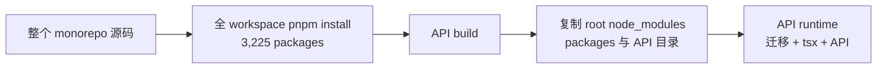
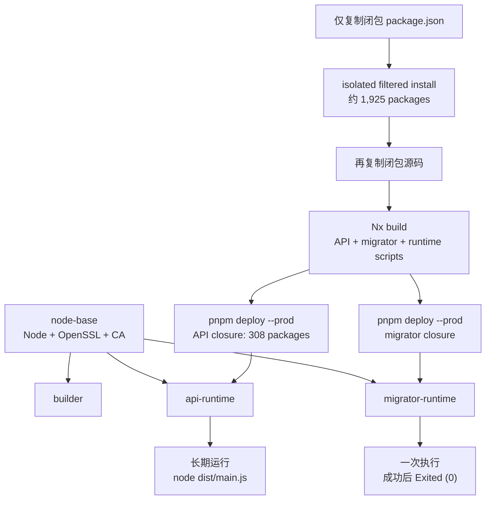

---
tags:
  - guide
  - development
  - docker
  - architecture
  - performance
description: MemoFlow 本地 Docker 镜像构建架构、三轮优化、指标变化与验证口径
created: 2026-08-01T00:00:00
updated: 2026-08-01T00:00:00
---

# Docker 镜像构建架构与优化记录

本文记录 2026-07-31 至 2026-08-01 完成的 API Docker 构建调整。重点不是单纯压缩镜像，而是同时解决以下问题：

- 首次构建下载整个 monorepo 的依赖，耗时长且网络敏感。
- API runtime 携带构建工具、数据库源码和数据库初始化工具。
- workspace hoisting 掩盖未声明依赖，本地可构建不代表隔离环境可构建。
- API 启动与数据库初始化耦合，运行时职责和发布顺序不清晰。
- 手写 external 列表容易随依赖变化漂移。

## 结果摘要

| 指标                    |                         调整前 |                         调整后 |                             变化 |
| ----------------------- | -----------------------------: | -----------------------------: | -------------------------------: |
| API 镜像                | 207,386,664 bytes（207.39 MB） | 143,355,478 bytes（143.36 MB） | -64,031,186 bytes，约 **-30.9%** |
| API production closure  |                   442 packages |                   308 packages |              -134，约 **-30.3%** |
| Builder install closure |                 3,225 packages |              约 1,925 packages |         约 -1,300，约 **-40.3%** |
| 独立 migrator 镜像      |                         不存在 | 175,893,322 bytes（175.89 MB） |               新增一次性运行镜像 |
| 热构建依赖下载          |       会受源码层和全量安装影响 |                 观察值为 **0** |        pnpm store 与依赖层可复用 |

这里的 MB 使用 Docker `image inspect` 返回的 bytes 除以 1,000,000，属于十进制 MB。不同 Docker 版本或 UI 可能以 MiB 展示，因此界面数值可能略有不同。

`migrator` 的 175.89 MB 不能直接与 API 镜像相加理解为常驻成本。它包含 Prisma CLI、schema 和数据库初始化脚本，只在部署阶段运行一次；成功后状态为 `Exited (0)`，不会持续占用应用运行内存。

## 调整前的构建状态

原 API Dockerfile 虽然已经使用 builder/runtime 两个阶段，但只做了“文件复制阶段分离”，没有形成真正收敛的依赖边界：

1. builder 一次复制整个 `apps/` 和 `packages/`。
2. 在 workspace 根目录执行无过滤的 `pnpm install --frozen-lockfile`。
3. runtime 复制根 `node_modules`、整个 `packages/`、API 应用目录及其 `node_modules`。
4. API 容器启动时先运行 shell 数据库初始化脚本，再通过 `tsx` 加载构建产物。
5. Prisma CLI、TypeScript loader、数据库源码、测试/构建元数据会进入 API runtime。



这仍然属于多阶段构建，但 runtime 的输入不是一个明确的 production closure。多阶段构建本身只保证可以从前一阶段选择文件，并不会自动判断哪些依赖属于生产运行时。

### 为什么前期下载依赖很慢

慢的根因不是最终 API 需要 3,225 个包，而是安装命令选择了整个 workspace：

- lockfile 描述整个 monorepo，包含 Web、Desktop、Mobile、测试和构建工具依赖。
- 根级无过滤安装会解析并链接所有 workspace 项目。
- Docker 缓存失效时，pnpm store 需要重新补齐大量 tarball。
- 旧 Dockerfile 在依赖安装前复制大范围源码，源码变化更容易让依赖层失效。
- 测试过单独执行 `pnpm fetch`，但它无法按所需 workspace closure 过滤，因此仍抓取约 3,225 个包，未采用。

## 调整后的目标架构

新的 `Dockerfile.api` 包含四个逻辑阶段：

1. `node-base`：Node 24、OpenSSL 与 CA 证书的共享系统层。
2. `builder`：只安装并构建 API/migrator 所需闭包。
3. `migrator-runtime`：只承载一次性数据库初始化。
4. `api-runtime`：只承载 API 构建产物和生产依赖。



## 第一轮：拆分 migrator 与 API runtime

数据库初始化从 API 启动脚本中移到独立的 `@memoflow/migrator` 应用。

### 调整前

- API 启动命令先运行 `run-migrations.sh`，然后运行 API。
- 数据库准备、Prisma reconciliation、知识索引 bootstrap 和 API 生命周期绑定。
- API 镜像必须保留 shell、Prisma CLI、tsx、数据库源码和相关脚本。
- 初始化失败表现为 API 启动失败，职责边界不清晰。

### 调整后

- migrator 依次准备 pgvector、执行 Prisma migration 或 `db push`、bootstrap 并验证知识索引。
- Compose 等 PostgreSQL healthy 后运行 migrator。
- API 依赖 `service_completed_successfully`；migrator 非零退出时 API 不启动。
- API 入口收敛为 `node dist/main.js`。
- migrator 可重复执行，成功状态为 `Exited (0)`。

本轮形成了两个不同的运行时边界：

| 边界             | 包含                                                                    | 不包含/不承担                                     |
| ---------------- | ----------------------------------------------------------------------- | ------------------------------------------------- |
| API runtime      | API `dist`、308 个生产闭包 package、Node runtime                        | Prisma CLI、tsx、TypeScript、数据库源码、迁移责任 |
| Migrator runtime | migrator `dist`、Prisma CLI、database Prisma 元数据、编译后的初始化脚本 | HTTP 服务、长期运行责任                           |

## 第二轮：收紧依赖闭包和 workspace 包边界

### Isolated 安装

builder 使用：

```text
pnpm --config.node-linker=isolated \
  --filter . \
  --filter @memoflow/api... \
  --filter @memoflow/migrator... install --frozen-lockfile
```

`node-linker=isolated` 让每个 workspace 包只能消费自己声明的依赖。此前由根级 hoisting 偶然提供的依赖会立刻暴露，因此在本轮逐包补齐了运行依赖、测试依赖和 Node/Express 类型依赖。

同时在 `pnpm-workspace.yaml` 关闭 `autoInstallPeers`，避免可选 peer 被静默安装后再次形成隐式依赖。

### 发布文件边界

API 闭包内的 workspace package 通过 `package.json#files` 只发布：

- 通常为 `dist`
- database 为 `dist + prisma`

源码、测试、tsconfig 和构建配置不再作为 production deploy 的默认输入。新增的 `api-runtime-dependency-audit.mjs` 会遍历 API 的 workspace 生产依赖闭包，检查：

- 禁止 `typescript`、`tsx`、`tsup`、`vitest`、ESLint 和 `@types/*` 出现在生产依赖。
- runtime package 必须发布 `dist`。
- runtime package 不得把 `src` 放入发布文件。

最终审计覆盖 API 闭包内 24 个 workspace package，并全部通过。

## 第三轮：构建层、external 和缓存收敛

### 依赖层与源码层分离

Dockerfile 先复制根依赖元数据和所需 workspace 的 `package.json`，执行 filtered install 后再复制源码。因此：

- 普通 `.ts` 源码修改不会让 pnpm install 层失效。
- 只有 lockfile、根依赖配置或闭包内 package manifest 变化才需要重新安装/链接依赖。
- 不相关 Web、Desktop 或 Mobile 源码不会进入 API builder context layer。

### External 策略

旧 API tsup 配置维护一长串手工 external。新配置使用 `skipNodeModulesBundle: true` 作为默认政策，只为 workspace/Prisma/PowerSync 等确实需要运行时解析的边界保留明确规则。

这不是把所有问题推给 external，而是把职责分成两类：

- 应用源码由 tsup 编译、打包。
- 第三方 Node runtime package 通过经过审计的 production closure 部署。

结果是 external 规则不再随每个第三方依赖增删而手工漂移，同时 production closure 仍由 pnpm deploy 和治理审计约束。

### 三层缓存

| 缓存层                  | 配置                                  | 复用内容                         | 失效条件示例                      |
| ----------------------- | ------------------------------------- | -------------------------------- | --------------------------------- |
| Docker dependency layer | manifest 先复制、源码后复制           | filtered install 结果            | lockfile 或相关 package.json 变化 |
| BuildKit pnpm store     | `memoflow-api-pnpm-store` cache mount | 已下载的 package tarball/content | cache 被清理、依赖版本变化        |
| BuildKit Nx cache       | `memoflow-api-nx-cache` cache mount   | API/migrator/package 构建结果    | Nx 输入 hash 变化                 |
| GitHub Actions cache    | `type=gha, scope=api`                 | CI BuildKit layers/cache mounts  | cache 淘汰、scope 或构建输入变化  |

在相同 lockfile、缓存仍存在的本机热构建中，pnpm 输出的新增下载量为 0。这个结果表示网络下载可以完全复用，不表示构建不再执行文件校验、链接、Nx hash 计算或镜像导出。

冷构建、清理 Docker BuildKit cache、切换机器或大幅修改 lockfile 后仍然需要下载依赖；优化后的收益是下载范围从整个 workspace 收敛到 API/migrator builder closure。

## 指标变化如何产生

### API 镜像减少 30.9%

精确计算为：

```text
207,386,664 - 143,355,478 = 64,031,186 bytes
64,031,186 / 207,386,664 ≈ 30.9%
```

主要来源：

- 不再复制根 `node_modules`。
- 不再复制整个 `packages/`。
- 移除 Prisma CLI、tsx 和 TypeScript。
- 不再携带数据库源码与 API 源码。
- 只复制 `pnpm deploy --prod` 生成的 API production closure。

### API production closure 从 442 降到 308

减少 134 个 package，约 30.3%。这是 production deploy 中实际进入 API 镜像的 package 数量，不是 builder 的开发依赖数量。它反映 API runtime 依赖边界收敛，不等同于 npm 顶层 dependency 数量。

### Builder closure 从 3,225 降到约 1,925

减少约 1,300 个 package，约 40.3%。builder 仍需要 Nx、TypeScript、tsup、Prisma 生成器和测试/构建适配器，因此它必然大于 API production closure；builder 不进入最终 API 镜像。

### 为什么 migrator 比 API 镜像更大

migrator 需要 Prisma CLI 及其引擎、database Prisma schema/config 和初始化脚本。API 已经不承担这些责任，所以 migrator 镜像大于瘦身后的 API 是符合职责边界的结果。migrator 是一次性发布工具，后续若继续优化，应针对 Prisma engine/CLI 和迁移产物做专门验证，不能简单删除文件。

## 本地构建和验证

推荐入口：

```bash
pnpm runtime:preflight:prod-like
pnpm docker:local:up
```

预期状态：

```text
memoflow-migrator-1   Exited (0)
memoflow-api-1        Up (...) (healthy)
memoflow-web-1        Up (...) (healthy)
memoflow-powersync-1  Up (...) (healthy)
memoflow-postgres-1   Up (...) (healthy)
memoflow-redis-1      Up (...) (healthy)
```

检查镜像大小：

```bash
docker image inspect memoflow-api:local memoflow-migrator:local \
  --format '{{.RepoTags}} {{.Size}}'
```

检查 migrator：

```bash
docker logs memoflow-migrator-1
```

日志应包含：

```text
[migrator] Database initialization completed
```

检查 API：

```bash
curl http://localhost:20201/healthz
```

预期返回：

```json
{ "status": "ok" }
```

依赖和架构门禁：

```bash
node tools/governance/api-runtime-dependency-audit.mjs
pnpm nx run migrator:test
pnpm nx run migrator:typecheck
pnpm nx run migrator:lint
pnpm nx run api:test -- --run src/scripts/database-startup-chain.test.ts
pnpm nx run memoflow:governance-check
```

## 生产发布变化

CI 现在从同一个 `Dockerfile.api` 构建两个目标：

- `api-runtime` → `memoflow-api`
- `migrator-runtime` → `memoflow-migrator`

生产 Compose 必须拉取匹配版本的 API 与 migrator，并执行完整编排：

```bash
docker compose -f docker-compose.prod.yml --env-file .env.production.local pull
docker compose -f docker-compose.prod.yml --env-file .env.production.local up -d
```

API 和 migrator 均禁用 Watchtower，防止 Watchtower 只替换 API、绕过数据库初始化门禁。Web 与 AI Service 仍可由 Watchtower 更新。

发布完成后必须确认：

1. migrator 为 `Exited (0)`。
2. migrator 日志显示初始化完成。
3. API 为 healthy。
4. API `/healthz` 返回成功。

## 关键实现文件

| 文件                                                | 责任                                              |
| --------------------------------------------------- | ------------------------------------------------- |
| `Dockerfile.api`                                    | builder、API runtime、migrator runtime 与缓存边界 |
| `apps/migrator/`                                    | 一次性数据库初始化应用                            |
| `packages/database/tsup.runtime-scripts.config.ts`  | 编译数据库运行时初始化脚本                        |
| `docker-compose.local.yml`                          | 本地 migrator → API 完成依赖                      |
| `docker-compose.prod.yml`                           | 生产 migrator → API 发布顺序                      |
| `tools/governance/api-runtime-dependency-audit.mjs` | API production closure 治理检查                   |
| `.github/workflows/publish-images.yml`              | API/migrator 镜像构建、缓存和推送                 |
| `tools/docker/publish-images.ps1`                   | 手工发布两个运行时目标                            |

## 后续可继续优化的方向

- 记录冷构建与热构建的分阶段耗时，而不只记录下载量。
- 用构建元数据自动生成 package 数量和镜像体积报告，减少人工统计漂移。
- 评估 Prisma CLI/engine 是否可转换为更小且受官方支持的迁移产物。
- 评估是否把 API 和 migrator 的共同 production packages 通过 registry/layer 排列进一步提高跨镜像 layer 复用率。
- 在 CI 增加镜像大小预算，超过阈值时给出告警而非静默回归。

这些优化必须继续保持当前门禁：API runtime 不重新引入数据库初始化责任，migrator 失败时 API 不启动，isolated install 不回退到隐式 hoisting。
