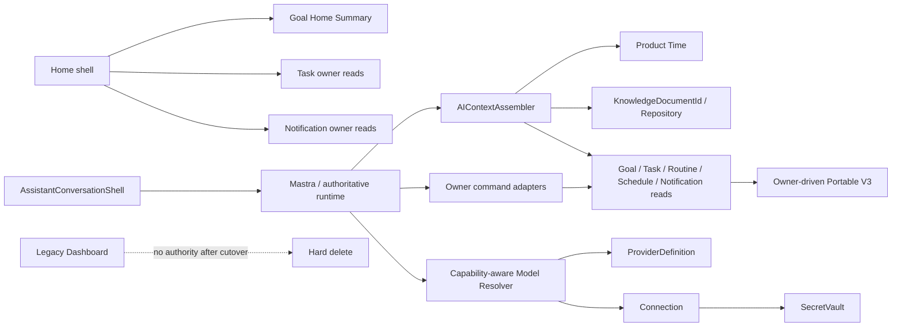
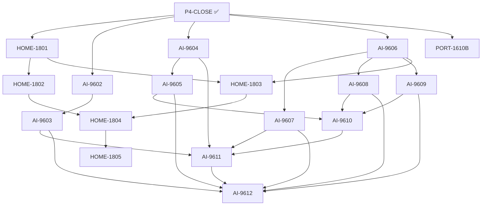

# MemoFlow System vNext Phase 5 — Home / Dashboard Retirement, AI Alignment, and Phase-4 Owner Portability

Status: **ACTIVE — delegated implementation control plane**
Created: 2026-09-18
Canonical integration branch: `feat/system-wide-vnext-convergence`
Phase-5 start head: `4d9098e6757102f57a70fc9a1d66dd8710fae941` (`P4-CLOSE` merged)
Execution mode: **DELEGATED** — ChatGPT Web plans/reviews/accepts; Codex CLI using `gpt-5.6-luna` implements.
Source of task truth: `docs/plan/active/2026-09-16-system-vnext-execution.tasks.json`.

---

## 1. Executive decision

Phase 5 is not a generic UI cleanup phase. It has four coupled outcomes:

1. **Home becomes a composition surface over owner reads**, never a Dashboard-owned truth store.
2. **Dashboard is fully retired** after both Home and AI stop consuming it and ActivityLedger ownership is resolved by evidence.
3. **AI converges on explicit runtime/provider/context/owner boundaries**, then destructively removes proven legacy AI persistence.
4. **Phase-4 surviving owners receive complete owner-driven Portable V3 capabilities** so later V3-only cutover can proceed without cloning persistence shapes.

The phase ends only when `HOME-1805`, `AI-9612`, and `PORT-1610B` are accepted on the canonical convergence branch. `PORT-1611` is Phase 6 and must not start early.

This document is the execution-level bridge between the system-wide plan, the AI vNext plan, and the task graph. If they differ, the task graph determines dependency order; this document determines the Phase-5 execution/review protocol.

---

## 2. Current verified checkpoint

### 2.1 Phase 4 closure

Phase 4 is formally complete.

- `R4-2201C` merged through PR #363.
- `P4-CLOSE` merged through PR #364.
- Canonical convergence head at Phase-5 start: `4d9098e6757102f57a70fc9a1d66dd8710fae941`.
- Phase-4 exact-head CI was green across governance, static analysis, unit, typecheck, build, Verification Children, Boundary, Integration, Coverage, Performance, four WebFlow shards, and Delivery Observation.
- Retired Phase-4 production/schema vocabulary scan closed with zero live owner/schema residue.

### 2.2 HOME-1801 / HOME-1802 implementation checkpoint

Before the execution mode switched to delegated implementation, ChatGPT Web implemented and locally verified the first Home wave in worktree:

`/home/dev/projects/memoflow-home-1801-1802`

Branch:

`chatgpt/home-1801-1802-owner-read`

The implementation is intentionally retained as a checkpoint rather than rewritten.

Implemented:

- Goal-owned `GoalHomeProgressSummary` contract.
- Goal application use case and application port.
- HTTP `GET /api/v1/goals/home-summary`.
- Electron IPC `goal:home-summary`.
- HTTP + IPC client adapters and `GoalClientPort` exposure.
- `useGoalHomeSummary()` Vue composable.
- `TodayOverviewPanel` migrated away from `useDashboard()`.
- `GoalCapsulePreview` migrated away from `useDashboard()`.
- `GoalProgressWidget` consumes Goal-owned summary row type rather than Dashboard contract.
- HTTP/IPC parity test for the new read path.
- Home owner-read focused tests and contract schema tests.

Local evidence at checkpoint:

- Contracts: `512/512` tests green.
- Goal: `492/492` tests green.
- App Vue: `782/782` tests green.
- App Vue typecheck green.
- Web typecheck green.
- Test inventory: `1198` files and consistent.
- Production Home/Goal preview files contain zero `useDashboard`, `DashboardData`, or `@memoflow/contracts/dashboard` imports.

Codex must begin by reviewing this checkpoint, not by deleting/reimplementing it from scratch.

---

## 3. Target architecture

### 3.1 Ownership map

| Product fact / capability                 | Sole owner after Phase 5                  | Composition/read consumers                     |
| ----------------------------------------- | ----------------------------------------- | ---------------------------------------------- |
| Goal lifecycle/progress/target/KR summary | Goal                                      | Home, AI workflows                             |
| Task plan/occurrence/progress             | Task                                      | Home, AI workflows                             |
| Knowledge document identity/content       | Repository/Knowledge                      | AI context/index/workflows                     |
| Routine definition/occurrence/interaction | Routine                                   | AI tools, Portable V3                          |
| Calendar/planner occupancy/conflicts      | Schedule/Planner                          | AI tools, Portable V3                          |
| Notification Fact/Inbox/action            | Notification                              | Home shell where needed, AI tools, Portable V3 |
| Conversation/workflow durable state       | Mastra/runtime boundary proven by AI-9602 | AI shell                                       |
| Provider metadata                         | ProviderDefinition                        | AI model resolution/onboarding                 |
| User/provider connection configuration    | Connection                                | AI model resolution/runtime                    |
| Provider credentials/secrets              | SecretVault                               | Host adapters only                             |
| Product Time                              | Time                                      | AIContextAssembler and all temporal consumers  |
| AI context envelope                       | AIContextAssembler                        | AI workflows/tools                             |
| AI model selection                        | ModelCatalog + capability-aware resolver  | AI runtime/workflows                           |
| AI execution observability                | AIExecutionRecord                         | operations/eval/audit                          |
| Home                                      | No domain ownership                       | Pure composition surface                       |
| Dashboard                                 | **Deleted**                               | None                                           |

### 3.2 North-star data flow



---

## 4. Protected contracts and non-goals

### 4.1 Protected contracts

Implementation must preserve all of the following unless a ticket explicitly retires them:

1. **Owner authority** — Home and AI may compose owner reads; they may not persist a second product truth.
2. **Goal semantics** — no `dueDate` compatibility field is introduced; Goal vNext lifecycle/target semantics remain canonical.
3. **Product Time** — no host-local `Date`/timezone fallback becomes AI semantic authority.
4. **Knowledge identity** — stable `KnowledgeDocumentId` survives rename/move and remains Repository-owned.
5. **Mastra restart/HITL semantics** — conversation/workflow authority is changed only after AI-9602 proves recovery behavior.
6. **Secret isolation** — secrets never enter ProviderDefinition, portable payloads, public DTOs, logs, or AI context envelopes.
7. **API/Desktop parity** — shared product semantics must remain equivalent across HTTP and IPC even when host storage adapters differ.
8. **Owner mutation validation** — AI proposes/calls; owner applications validate and mutate.
9. **Portable V3 ownership** — owner capabilities define payload semantics; data-portability must not clone raw persistence models.
10. **No compatibility resurrection** — no DashboardData compatibility adapter, old Reminder authority, legacy ScheduleTask authority, Notification aggregate authority, or deprecated AI shadow state is reintroduced to ease migration.

### 4.2 Non-goals

- No new generic analytics domain unless HOME-1804 proves a current product need.
- No preservation/migration of obsolete production data; ADR-111 destructive zero-legacy-data policy still applies.
- No redesign of already-accepted Goal/Task/Routine/Schedule/Notification product semantics.
- No V2 portability deletion before `PORT-1611`.
- No global interface splitting merely for aesthetics; AI-9611 splits only proven consumer boundaries.
- No weakening of coverage/governance/CI thresholds to make migration pass.

---

## 5. Execution model: Codex implements, ChatGPT reviews

### 5.1 Writer ownership

For Phase 5, implementation ownership is delegated to Codex CLI with model `gpt-5.6-luna` using the existing ChatGPT-authenticated Codex session on GCP Dev.

ChatGPT Web must not edit the same mutable worktree while Codex is implementing.

ChatGPT Web responsibilities:

- maintain this control plan and task boundaries;
- inspect Codex diffs independently;
- review architecture, contracts, tests, residue and CI evidence;
- classify findings P0/P1/P2/P3;
- send P0/P1/P2 repairs back to Codex;
- accept/merge only after exact-head evidence is green.

Codex responsibilities:

- implement only the assigned wave/tickets;
- inspect the existing repository before changing behavior;
- preserve protected contracts;
- add/update tests with the code;
- validate locally from narrow to broad;
- commit coherent checkpoints;
- report actual commands/results and remaining risks;
- never silently start a downstream task whose dependencies are not accepted.

### 5.2 Parallelism

Parallel Codex workers are permitted only when all of these are true:

- separate Git worktrees/branches;
- disjoint mutation keys;
- no shared schema/contract file is concurrently edited;
- each worker has an explicit ticket boundary;
- integration happens after each worker reaches a green local checkpoint.

Maximum useful Phase-5 frontier parallelism is four lanes, not an obligation to use four writers.

---

## 6. Dependency graph and execution waves



### Wave 5A — Freeze Home owner-read cutover

Tickets: `HOME-1801`, `HOME-1802`
Status: implementation checkpoint exists; Codex completes review/acceptance/delivery.

Codex steps:

1. Review the existing checkpoint against ticket scope and this plan.
2. Verify `GoalHomeProgressSummary` is narrow and owner-owned; do not turn it into `DashboardData v2`.
3. Verify active Goal selection is only `Planned`/`InProgress`, active total is independent of preview row limit, ordering is deterministic, and percentage normalization is bounded.
4. Verify HTTP and IPC use the same `GoalApplicationPort` semantics.
5. Verify Home loading/error/retry behavior degrades locally without cached Dashboard truth.
6. Search production Home/Goal preview for Dashboard imports/usages; require zero.
7. Run focused tests, full Goal/App Vue tests, relevant typechecks, lint/build, inventory, and affected validation.
8. Commit the wave and prepare it for ChatGPT review.

Acceptance:

- HOME-1801 and HOME-1802 acceptance criteria are simultaneously satisfied.
- No Home/Goal capsule production consumer requires Dashboard.
- No new generic analytics or compatibility contract was added.

### Wave 5B — Independent foundations

Can run in isolated worktrees after Wave 5A checkpoint is stable:

- `AI-9602` — Runtime authority characterization.
- `AI-9604` — ProviderDefinition / Connection / SecretVault.
- `AI-9606` — AIContextAssembler.
- `PORT-1610B` — Phase-4 owner Portable V3 capabilities.

These four lanes have disjoint declared mutation keys. If any implementation discovers a required edit to a shared cross-lane contract, stop that lane and surface the conflict before writing the shared file.

#### AI-9602 execution detail

1. Trace conversation/thread/workflow identity from API/Desktop shell into Mastra persistence.
2. Trace restart, reconnect, hydration, HITL interrupt/resume and retry behavior.
3. Inventory every `AiMessage` transcript persistence consumer.
4. Classify each legacy consumer: authoritative, derived/recoverable, or dead.
5. Add characterization fixtures proving recovery boundaries before deletion.
6. Produce an evidence ledger consumed by AI-9603 and AI-9610.

Do **not** delete AI persistence in this ticket.

#### AI-9604 execution detail

1. Inventory provider catalog metadata, user connection state, keys/secrets and host persistence.
2. Define explicit ProviderDefinition, Connection and SecretVault ports/contracts.
3. Ensure public/portable DTOs cannot carry secret material.
4. Implement API/Desktop host-specific vault adapters behind one semantic seam.
5. Cut onboarding/settings/runtime consumers to the seam.
6. Delete duplicate provider/secret ownership only after consumers are migrated.

#### AI-9606 execution detail

1. Inventory duplicated context/time/trust/token assembly across workflows/tools.
2. Define bounded `AIContextAssembler` input/output contracts.
3. Inject canonical Product Time/UserTimeContext.
4. Attach provenance/trust metadata to assembled context.
5. Enforce explicit context/token budgets and deterministic truncation/selection rules.
6. Cut current runtime/workflows to the assembler without broad owner read privileges.
7. Add API/Desktop composition tests and failure-path tests.

#### PORT-1610B execution detail

1. Inventory surviving Routine, Schedule/Planner and Notification portable product facts.
2. Define owner-driven V3 payloads/capabilities only for durable product facts.
3. Exclude transient runtime/device state unless an owner ADR explicitly permits it.
4. Implement export, dry-run, validation and apply through owner capabilities.
5. Register capabilities in API/Desktop with deterministic dependency/reference ordering.
6. Add round-trip and invalid-reference tests.
7. Preserve V2 surface until PORT-1611.

### Wave 5C — Dependent convergence

After the relevant Wave 5B foundations are accepted:

- `AI-9603` after AI-9602.
- `AI-9605` after AI-9604.
- `AI-9607`, `AI-9608`, `AI-9609` after AI-9606.
- `HOME-1803` after HOME-1801 + AI-9606.

#### HOME-1803

Replace `ControlledAnalyticsReadAdapter` and Desktop equivalent Dashboard dependencies with explicit owner reads.

Required behavior:

- no `DashboardData` cast or generic Dashboard fetch;
- analytics/context reads are explicit bounded projections from current owners;
- AI does not become an owner of Goal/Task/Knowledge/activity truth;
- API/Desktop semantics remain equivalent.

#### AI-9603

Use AI-9602 evidence to make Mastra/runtime the sole durable workflow authority. UI state may keep ephemeral rendering/cache state only. Verify reconnect/restart/interrupt-resume end to end.

#### AI-9605

Create one capability-aware model resolution path over ProviderDefinition/Connection. Resolve by explicit `ExecutionRequirement`; unsupported capabilities fail closed rather than silently falling back.

#### AI-9607

Cut AI index/citation identity to `KnowledgeDocumentId`. Remove path-derived identity and duplicated durable index-status authority; no repair/migration of old rows.

#### AI-9608

Align Goal/Task/Knowledge structured drafts/tools/adapters to canonical owner contracts. Remove temporary convergence DTO translations. Preserve deterministic/resumable workflow semantics.

#### AI-9609

Align Routine/Planner/Notification tools to canonical owner contracts. AI may request owner commands; it may not write owner persistence or recreate retired reminder/schedule/notification models.

### Wave 5D — Dashboard retirement

Tickets: `HOME-1804` -> `HOME-1805`.

#### HOME-1804 evidence decision — resolved: destructive deletion

Evidence after HOME-1803:

1. the durable ledger is written only by the legacy API recorder;
2. its remaining reads are the retiring Dashboard path and one transitional API AI adapter;
3. Desktop AI already derives the same bounded recent-activity projection from Goal/Task/Schedule owner facts;
4. no independent product surface, owner command, retention policy, or portable user truth requires a durable activity feed.

Decision: delete the recorder/table and make API recent activity owner-derived like Desktop. Do **not** create `ActivityFeed`, generic analytics infrastructure, or another durable cross-domain authority. HOME-1805 then hard-deletes the remaining Dashboard surface.

#### HOME-1805 hard delete

Delete Dashboard as one coherent destructive batch:

- package/domain/application/persistence;
- contracts and public DTOs;
- API routes;
- Electron IPC;
- Vue composables/module remnants;
- Dashboard config/settings residue;
- Prisma/PowerSync mappings or schema;
- compatibility redirect `/dashboard` and its tests;
- imports/fakes/fixtures/governance entries that positively preserve Dashboard.

Keep historical ADR/archived references as history; current docs must describe Dashboard as retired.

Acceptance requires production/schema residue scan plus fresh bootstrap/reset evidence.

### Wave 5E — AI legacy destruction and capability split

#### AI-9610

Depends on AI-9605 + AI-9608 + AI-9609.

1. Re-run legacy AI persistence consumer audit.
2. Rename/normalize the surviving execution observability concept to `AIExecutionRecord`.
3. Delete only legacy quota/generation/message/provider rows proven non-authoritative.
4. Apply Prisma + PowerSync + contracts + mappings deletion together.
5. Use destructive reset/reseed; do not add row migration compatibility.
6. Run eval replay plus fresh database/bootstrap verification.

#### AI-9611

Only after AI-9603, AI-9604, AI-9607 and AI-9610 are stable. Split broad application capabilities only where current consumer evidence proves a smaller boundary. Do not churn facades solely for style.

### Wave 5F — AI closeout

Ticket: `AI-9612`.

Run the five-layer AI review:

1. contract correctness;
2. vertical completeness;
3. behavioral completeness;
4. engineering quality;
5. plan/document truth.

Review failure behavior explicitly:

- restart/reconnect;
- HITL interrupt/resume;
- provider unavailable/secret missing;
- model capability unavailable;
- context budget exhaustion/truncation;
- Knowledge document missing/renamed;
- owner command validation failure;
- retry limits/idempotency;
- API/Desktop parity.

Repair all P0/P1/P2 and re-review adjacent paths. Run `ai:eval:replay` on the accepted exact head.

---

## 7. Ticket verification matrix

| Ticket     | Required local verification                                                                                                                    |
| ---------- | ---------------------------------------------------------------------------------------------------------------------------------------------- |
| HOME-1801  | `pnpm nx run goal:test`; `pnpm nx run app-vue:test`; `pnpm nx run app-vue:typecheck`                                                           |
| HOME-1802  | `pnpm nx run app-vue:test`; `pnpm nx run app-vue:typecheck`; `pnpm nx run web:typecheck`                                                       |
| HOME-1803  | `pnpm nx run ai:test`; `pnpm nx run api:typecheck`; `pnpm nx run desktop:typecheck`; relevant Dashboard characterization while it still exists |
| HOME-1804  | Dashboard/AppVue/AI focused tests + `pnpm governance:check` + evidence scan                                                                    |
| HOME-1805  | AppVue + AI tests; `pnpm typecheck`; `pnpm test:inventory`; `pnpm governance:check`; fresh DB reset/bootstrap; residue scan                    |
| AI-9602    | AI tests/typecheck; API/Desktop typecheck; restart/reconnect/HITL characterization                                                             |
| AI-9603    | AI + AppVue tests; API/Desktop typecheck; reconnect/restart/interrupt-resume integration                                                       |
| AI-9604    | AI tests/typecheck; API/Desktop typecheck; secret-leak negative tests                                                                          |
| AI-9605    | AI tests/typecheck; `pnpm nx run ai:eval:replay`                                                                                               |
| AI-9606    | AI tests/typecheck; API/Desktop typecheck; Product Time/trust/budget tests                                                                     |
| AI-9607    | AI tests/typecheck; Repository tests; stable-id rename/move fixtures                                                                           |
| AI-9608    | AI + Goal + Task tests; API/Desktop typecheck; resumability fixtures                                                                           |
| AI-9609    | AI + Routine(`reminder` package) + Schedule + Notification tests; eval replay                                                                  |
| AI-9610    | AI tests + eval replay; API/Desktop typecheck; governance; Prisma/PowerSync parity/reset                                                       |
| AI-9611    | AI tests/typecheck; API/Desktop typecheck; governance                                                                                          |
| AI-9612    | AI tests/typecheck/build; eval replay; docs/governance; five-layer review ledger                                                               |
| PORT-1610B | data-portability test/typecheck; Routine/Schedule/Notification tests; API/Desktop capability parity                                            |

Every coherent wave additionally runs:

```bash
pnpm test:inventory -- --check
pnpm docs:check
pnpm governance:check
pnpm nx sync:check
pnpm nx affected -t lint
pnpm nx affected -t typecheck
pnpm nx affected -t test
pnpm nx affected -t build
```

Use the convergence branch as the `--base` reference where Nx requires an explicit base.

---

## 8. CI cost policy learned from Phase 4

Phase 4 demonstrated that remote CI must be an acceptance gate, not a residue-discovery tool.

For Phase 5:

1. Do not open/push a CI-triggering PR immediately after a focused test turns green.
2. First run static residue scans for the retired/changed boundary.
3. Run focused package tests.
4. Run integration/coverage lanes locally when the wave changes a cross-domain or persistence boundary.
5. Run the relevant WebFlow shard(s) locally when product flow changes.
6. Freeze the working tree.
7. Commit an exact head.
8. Run affected lint/typecheck/test/build + inventory/docs/governance/sync against that exact head.
9. Only then push/open/update the PR once.
10. Remote CI must validate that exact head; if it reveals a real finding, repair locally and repeat the pre-push matrix before the next CI run.

Never chase downstream Oracle failures when an upstream child lane is already red.

---

## 9. ChatGPT review gate for every Codex wave

ChatGPT independently reviews five layers before accepting a delegated wave.

### 9.1 Contract correctness

- correct owner and identity semantics;
- schemas/routes/IPC/events match;
- retired compatibility surfaces are not resurrected;
- Product Time and SecretVault boundaries hold.

### 9.2 Vertical completeness

Trace actual path end to end:

UI / runtime -> client port -> transport -> application port -> owner/read/persistence -> response/hydration.

No layer may silently drop state, provenance, tool calls, interrupts or non-text workflow data.

### 9.3 Behavioral completeness

Check at least loading/empty/error/retry, restart/reconnect, validation failure, cancellation/interrupt where relevant.

### 9.4 Engineering quality

Review ownership, typing, validation, duplication, logs/observability, test quality, generated artifacts and diff hygiene.

### 9.5 Plan integrity

- ticket scope matched;
- claimed commands actually ran;
- current docs reflect implementation;
- remaining dependency graph is accurate.

Findings:

- P0/P1/P2 -> returned to Codex for focused repair before acceptance.
- P3 -> may be deferred if documented and unrelated to correctness.

---

## 10. Residue scans required before destructive closures

### Dashboard retirement scan

Search production/schema/current-doc surfaces for:

- `DashboardData`
- `useDashboard`
- `DashboardService`
- Dashboard API/IPC channels
- DashboardConfig/current Dashboard settings
- `ActivityLedger` after HOME-1804 decision
- `/dashboard` compatibility route/redirect

Historical ADR/archive references are not positive residue.

### AI legacy deletion scan

Before AI-9610 acceptance, search for every legacy Prisma/PowerSync AI table/model and all direct consumers. No table/model is deleted based only on naming; deletion requires AI-9602/9608/9609 consumer evidence.

### Portable V3 scan

Before PORT-1610B acceptance, ensure no V3 owner capability contains raw persistence-shaped cloning or device/transient state without explicit owner approval.

---

## 11. Rollback / containment

- Each wave begins from a clean Git checkpoint.
- Destructive schema batches use source rollback + database reset/reseed, never compatibility dual truth.
- Prisma + PowerSync parity lands in the same coherent destructive batch.
- A delegated worker that discovers scope expansion stops and reports it; it does not silently absorb another ticket.
- If a wave fails ChatGPT review, Codex repairs the same branch/worktree unless the root cause requires a clean restart.

---

## 12. Phase-5 completion gate

Phase 5 is complete only when all of the following are true on the canonical convergence branch:

- `HOME-1801..1805` accepted; Dashboard has no live production/schema authority.
- `AI-9602..9612` accepted with no unresolved P0/P1/P2 review findings.
- `PORT-1610B` accepted; Phase-4 surviving owners have complete owner-driven V3 coverage.
- Home and AI consume explicit owner reads/capabilities rather than Dashboard truth.
- Provider metadata/connection/secrets are split correctly and secrets do not leak.
- AI context uses Product Time/trust/token-budget through one assembler.
- Knowledge index/citations use stable `KnowledgeDocumentId`.
- Owner workflow/tool adapters use canonical owner contracts.
- Legacy AI persistence deletion is evidence-based and Prisma/PowerSync-consistent.
- AI eval replay and required exact-head CI are green.
- Current documentation describes the implemented Phase-5 state.

Then, and only then, Phase 6 starts with `PORT-1611`.

---

## 13. Immediate delegated handoff

The first Codex/Luna assignment is:

1. Read this Phase-5 control document plus the system task graph and AI vNext plan.
2. Review the existing HOME-1801/1802 checkpoint; repair only verified scope/quality gaps.
3. Finish its local exact-head acceptance and commit it as the first Phase-5 checkpoint.
4. Do **not** start a conflicting writer in that worktree.
5. After HOME checkpoint is stable, proceed with the dependency-ready Phase-5 frontier, preferring isolated worktrees for `AI-9602`, `AI-9604`, `AI-9606`, and `PORT-1610B` if parallel agent capability is used.
6. Do not push CI repeatedly; follow the CI cost policy above.
7. Stop implementation at a wave review boundary and leave a precise evidence report for ChatGPT Web review before destructive downstream dependencies are considered accepted.
