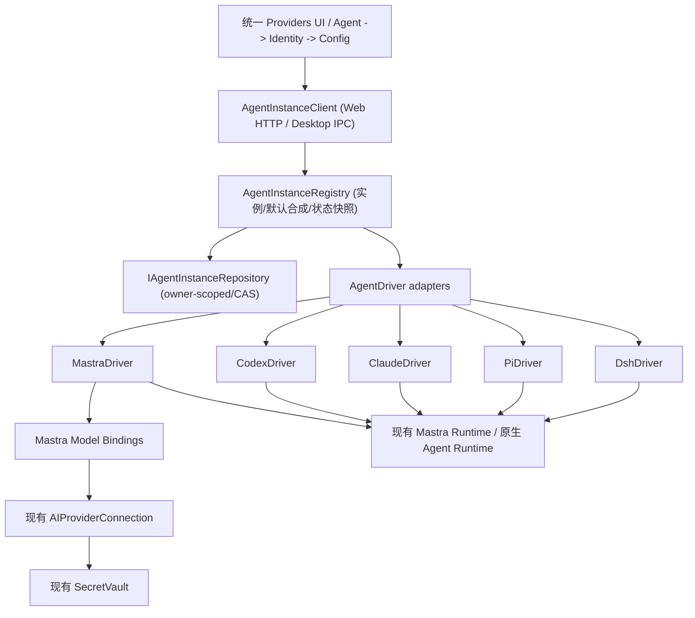

# MemoFlow · Unified Agent Instance Registry V2

> **状态：** 方向已确认；完整方案待按阶段实施与验收。本文为本主题**唯一当前实施主文档**，保留 PR #444 已交付的首批 UI/Native 证据。撰写本方案不代表后续阶段已完成。
>
> **范围：** Web + Desktop 共享 Agent 实例领域契约、设置 UI 与生命周期；Web 仅可使用 Mastra，Desktop 可使用 Mastra / Codex / Claude Code / Pi / DSH。
>
> **基线：** MemoFlow `main` `e905a4d10c2` → Draft [PR #444](https://github.com/BakerSean168/memoflow/pull/444)，首批提交 `bc536a24dd0`；T3 Code 固定 [`a5b482452dc8ca87625d5a80f83be0a9b56674de`](https://github.com/pingdotgg/t3code/tree/a5b482452dc8ca87625d5a80f83be0a9b56674de)（2026-10-10）。历史源码研究仍见 [本地 BYOA T3 源码研究](../../analysis/2026-10-09-local-byoa-t3-source-study.md)。
>
> **现有架构约束：** [ADR-120](../../architecture/adr/ADR-120-selectable-assistant-runtimes-and-builtin-mastra.md)、[ADR-121](../../architecture/adr/ADR-121-desktop-local-agent-host-and-tool-bridge.md) 和 [本地 BYOA 实施计划](./2026-10-09-local-byoa-and-builtin-assistant.md)。本文补充**实例管理**，不改变「单次会话只有一个执行状态所有者」。

## 0. 执行摘要与确定的产品决策

**统一 Agent，不统一底层执行协议。** Mastra 与 Codex、Claude Code、Pi、DSH 都是一级 `AgentDriver`；同一套 `AgentInstance` 身份、注册、状态、增删改查、默认实例、添加向导和选择器；每个 Driver 自己实现配置、状态探测、认证入口、模型发现和会话执行。

已确定：

1. Web 的 Driver 目录**只有 Mastra**。Desktop 有 Mastra、Codex、Claude Code、Pi、DSH。宿主端执行实际权限校验，不能仅靠隐藏按钮。
2. 默认实例属于**运行时隐式合成**：Web 至少可见 `mastra`；Desktop 可见上述五种默认槽位，无须预装 CLI、登录、API Key 或写库。
3. 用户可创建同种 Driver 的多个实例。**先持久化 Agent 实例，后配置认证和模型**；未配置不是创建失败。
4. 左侧是 Agent **实例列表**；右侧展示选中实例的身份、状态、安装/认证、模型、权限与 Driver 专属设置。OpenRouter、AnyRouter、DeepSeek 等是 Mastra 的**模型服务连接**，不出现在 Agent 选择目录。
5. Mastra 可以关联 **0..N 个**模型服务连接，一个模型服务连接也可被多个 Mastra 实例引用；Mastra 不需要独立 CLI，也不等于无需模型认证。
6. Agent Instance 只存模型连接 ID / 安全引用，不存明文 API Key。现有 SecretVault、模型能力校验、模型连接生命周期必须继续有效。
7. 已建会话始终绑定原 Agent 实例/模型选择；实例失效、模型凭据错误时**不自动换 Agent、不隐式重试到另一个渠道**。
8. **共享逻辑 != 跨设备凭据同步。** Web 的云端身份资源与 Desktop 当前 Profile 的本地资源分别持久化；当前 `ai_provider_configs` Desktop 标记 `localOnly`，未设计安全跨宿主密钥转移前不得宣称数据或凭据自动同步。

**非目标：** 增建通用推理循环、引入第二编排引擎、移植 T3 远程环境/工作树/完整账户托管、强制所有 Driver 支持统一 Endpoint/API Key、自动安装 CLI、后台付费推理探活。

## 1. 术语与边界（避免重回 Provider 混用）

| 名称                           | 定义                                              | 示例 / 权威性                                                    |
| ------------------------------ | ------------------------------------------------- | ---------------------------------------------------------------- |
| `AgentDriver`                  | 应用打包支持的一类执行适配器及其能力描述          | `mastra`、`codex`、`claude`、`pi`、`dsh`；代码目录，不是用户记录 |
| `AgentInstance`                | 用户可命名、启停、选择的**某 Driver 配置实例**    | `mastra`、`mastra-anyrouter`、`codex-work`；实例注册表是配置真值 |
| `ModelServiceConnection`       | 模型服务的 Endpoint、SecretVault 引用、可用模型等 | 现有 `AIProviderConnection` / `AiProviderConfig`；**不是 Agent** |
| `AgentInstanceModelBinding`    | Mastra 实例对一个模型服务的授权关联与选择范围     | `mastra-anyrouter` → `AnyRouter connection ID`；不复制密钥       |
| `AgentRuntimeStatus`           | 运行时测出的安装、认证、模型与可用性快照          | 有过期时间；不是持久化配置或权限授予                             |
| `AssistantConversationBinding` | 会话固定的实例、模型及原生会话关联                | 会话开始时确定；执行状态归对应 Driver                            |

**命名原则：** UI 标题 `Providers` 可以保留以贴近 T3；但类型/注释统一使用 `AgentInstance` 与 `ModelServiceConnection`。旧 `LocalAgentConnection` 是既存本地持久化形态，不再作为未来业务概念的上位类型。

## 2. T3 Code 源码事实与可复用行为

本节事实固定到 2026-10-10 的 `a5b48245`，只借鉴**行为/契约**，不直接复制 Effect/React 运行时。

| T3 行为                                                                                                        | 固定源码入口                                                                                                                                                                                           | MemoFlow 对应实现                                                              |
| -------------------------------------------------------------------------------------------------------------- | ------------------------------------------------------------------------------------------------------------------------------------------------------------------------------------------------------ | ------------------------------------------------------------------------------ |
| 从显式 `settings.providerInstances` 合成内置默认实例；若同名 ID 已存在则不重复                                 | [ProviderInstanceRegistryHydration.ts L59-76](https://github.com/pingdotgg/t3code/blob/a5b482452dc8ca87625d5a80f83be0a9b56674de/apps/server/src/provider/ProviderInstanceRegistryHydration.ts#L59-L76) | 宿主的 `AgentInstanceRegistry.hydrate`；不要只在 Vue `computed` 里制造孤立卡片 |
| Driver 集合是打包时注册项；默认实例由 `hasDefaultInstance` 控制                                                | [builtInDrivers.ts](https://github.com/pingdotgg/t3code/blob/a5b482452dc8ca87625d5a80f83be0a9b56674de/apps/server/src/provider/builtInDrivers.ts)                                                      | 根据 Web/Desktop 能力注册不同 Driver 集                                        |
| 运行时 Registry 处理不可识别 Driver、配置校验、热更新和实例资源生命周期                                        | [ProviderInstanceRegistry.ts](https://github.com/pingdotgg/t3code/blob/a5b482452dc8ca87625d5a80f83be0a9b56674de/apps/server/src/provider/ProviderInstanceRegistry.ts)                                  | 失配显示 `unavailable`；重建/关闭按实例进行                                    |
| `Agent → Identity → Config`；名称、唯一 slug、强调色，保存实例时**不要求认证**                                 | [AddProviderInstanceDialog.tsx L308-362](https://github.com/pingdotgg/t3code/blob/a5b482452dc8ca87625d5a80f83be0a9b56674de/apps/web/src/components/settings/AddProviderInstanceDialog.tsx#L308-L362)   | 同一 Vue 向导、一次显式 Create 命令；之后右侧配置                              |
| Codex 通过短时 `codex app-server` 的 `initialize` / `account/read` / `model/list`（含按需模型/Skills）判断状态 | [CodexProvider.ts L421-488](https://github.com/pingdotgg/t3code/blob/a5b482452dc8ca87625d5a80f83be0a9b56674de/apps/server/src/provider/CodexProvider.ts#L421-L488)                                     | 复用现有 `CodexDriver.probe`；可探测隐式默认实例                               |
| Claude 先运行 `claude --version`，再 SDK 无用户消息初始化读取认证/能力                                         | [ClaudeProvider.ts](https://github.com/pingdotgg/t3code/blob/a5b482452dc8ca87625d5a80f83be0a9b56674de/apps/server/src/provider/ClaudeProvider.ts)                                                      | 复用现有 `ClaudeDriver.probe`；明确不发起正常推理                              |
| 初始快照为「尚未检测」；后台异步首次探测、按需/手动刷新                                                        | [managedProvider.ts L222-309](https://github.com/pingdotgg/t3code/blob/a5b482452dc8ca87625d5a80f83be0a9b56674de/packages/provider-core/src/server/managedProvider.ts#L222-L309)                        | 列表立即出现；状态异步更新，刷新有界                                           |
| Codex `binaryPath`、`homePath`、`shadowHomePath`；Claude `binaryPath`、`homePath` 等 Driver-specific 设置      | [settings.ts L591-709](https://github.com/pingdotgg/t3code/blob/a5b482452dc8ca87625d5a80f83be0a9b56674de/packages/contracts/src/settings.ts#L591-L709)                                                 | 不向所有 Driver 强塞 Endpoint/Key                                              |
| Provider Instance 变更按单实例更新；认证/模型目录通过对应 Driver 获得                                          | [serverSettings.ts L223-253](https://github.com/pingdotgg/t3code/blob/a5b482452dc8ca87625d5a80f83be0a9b56674de/apps/server/src/serverSettings.ts#L223-L253)                                            | 独立持久化 + Revision/CAS + 按实例探测                                         |

**注意两处不能盲抄的语义：**

- T3 在尚未检查时初始 `installed: false` 并附「not checked」提示；MemoFlow 应**显式使用 `unchecked`**，避免误判未安装。
- T3 的 `setupMode: managed`、Shadow Home、远程 Environment、模型配额等是额外功能；MemoFlow V2 先采用已安装 CLI/原生认证/本地 Profile。按 Driver 能力渐进增强，不阻塞本次收敛。

## 3. 当前 MemoFlow 真实基线（PR #444）

| 部位                                                              | 已经有的能力                                                            | 尚缺的闭环                                                                   |
| ----------------------------------------------------------------- | ----------------------------------------------------------------------- | ---------------------------------------------------------------------------- |
| `packages/app-vue/.../AISettings.vue`                             | 左实例/右详情、Web Mastra 默认展示、Desktop 四个本地默认槽              | 默认仍是 UI 投影，未接正式运行时 Registry；Mastra 实例仍与已验证模型连接耦合 |
| `AgentInstanceWizard.vue`                                         | Agent → Identity → Config；Desktop 原生实例可保存，slug/强调色支持      | Mastra 的第三步仍转旧模型服务 onboarding；未配置不能持久化独立实例           |
| `local-agent.dto.ts` + `LocalAgentRepository`                     | Profile 内 Native 连接 UUID、可选 slug、唯一性、Revision、旧数据兼容    | 缺统一 `AgentInstance` 真值；Native 默认槽无持久 ID 时无法直接 Probe         |
| `LocalAgentRuntime.probeConnection(identityId, id)`               | 真实 Codex/Claude/Pi/DSH 状态检查                                       | 必须先用已保存的 Connection ID 查库                                          |
| `ai_provider_configs`、Prisma/PowerSync Repositories、SecretVault | Endpoint、密钥引用、已验证模型、原有会话模型能力；Web 云端/Desktop 本地 | 缺「Mastra Instance → 0..N ModelServiceConnection」独立关系                  |
| `useAIModelSelection.ts`                                          | 按 `providerId::modelId` 切换并记忆模型                                 | 尚无 Agent Instance 选择/绑定作为一级维度，须保护旧会话                      |

**首批 PR 证据（已完成，不可重复算成 V2 验收）：** Vue Providers/locale 36 项、AI Repository + Secret/Probe 15 项、AI native 回归 14 项、Contracts 12 项、Desktop 定向 2 项、四个项目类型检查及定向 lint 通过；Web Playwright 只有测试发现，未跑真实浏览器场景；Windows 打包与生产发布均未证实。详见 [PR #444](https://github.com/BakerSean168/memoflow/pull/444)。

## 4. 目标体系与职责隔离



### 4.1 共享的是管理契约，不是第三套执行引擎

- `AgentInstanceRegistry`：读取合成后的实例、创建/修改/删除显式记录、管理当前宿主允许的 Driver、获取状态快照、转发 Driver 探测、触发失效通知。
- `AgentDriver`：提供元数据、默认配置、Config schema/表单能力、`probe`、执行适配器引用。**不负责凭据的跨 Driver 复制**。
- `MastraDriver`：包装现成 Mastra 模型连接与模型发现；底层仍由原 Mastra runtime 执行。
- `Codex/Claude/Pi/DSH Driver`：复用已实现 native runtime/IPC，不引入 T3 的完整 effect orchestration。
- Web/Server 侧仅注册 Mastra；Desktop 宿主才注册 native 驱动。服务端再次校验 `driver`/`capabilities`，浏览器手工提交 `codex` 创建请求必须拒绝。

### 4.2 实例 ID 与 Owner

建议采用 **T3 风格不可变 `instanceId` slug** 作为新公共路由键（示意：`mastra`、`codex`、`mastra-anyrouter`、`codex-work`）。规则先保持 PR #444 的小写 `[a-z][a-z0-9]*(?:-[a-z0-9]+)*`，最大 64 字符，防止实现期间同时存在两个不一致规范。

- 同一 Owner 范围内唯一：`(ownerScope, instanceId)`。**显示名称可重命名，instanceId 不可直接修改**。
- Web Owner 来自服务端验证过的 Cloud Identity；Desktop Owner 来自当前激活的 Profile。前端**不得传任意 ownerId**。
- 物理数据库可用复合键/内部 surrogate PK，但服务层只暴露固定 `instanceId`；不可把随首次认证才生成的模型连接 UUID 当成 Agent Instance ID。
- 旧 Native `LocalAgentConnection.id` UUID 及已有本地会话引用需要迁移映射；在回填和运行时桥完成前不得移除旧记录或使原生会话失效。

## 5. 目标契约（示意规格，字段最终须通过 Zod + Repository 验证）

```ts
type AgentDriverKind = 'mastra' | 'codex' | 'claude' | 'pi' | 'dsh';
type AgentInstanceId = string; // immutable slug, unique per verified owner
type AgentOwnerScope = 'cloud_identity' | 'desktop_profile';

type AgentConfig =
  | { driver: 'mastra'; defaultModel?: { connectionId: string; modelId: string } }
  | { driver: 'codex'; executablePath?: string; homePath?: string }
  | { driver: 'claude'; executablePath?: string; homePath?: string }
  | { driver: 'pi'; executablePath?: string; homePath?: string }
  | { driver: 'dsh'; executablePath?: string; homePath?: string };

interface AgentInstanceRecord {
  instanceId: AgentInstanceId;
  driver: AgentDriverKind;
  displayName: string;
  accentColor?: string;
  enabled: boolean;
  config: AgentConfig; // must match driver; never credential plaintext
  revision: number; // optimistic concurrency
  createdAt: number;
  updatedAt: number;
}

interface AgentInstanceView {
  instanceId: AgentInstanceId;
  driver: AgentDriverKind;
  displayName: string;
  enabled: boolean;
  origin: 'implicit' | 'persisted';
  revision?: number; // only present on persisted records
  status: AgentRuntimeStatus; // ephemeral, not persisted as credential truth
  capabilities: AgentDriverCapabilities;
}
```

**严格边界：** `AgentConfig` 不存 `apiKey`、Access Token、原生用户登录票据或任意无审查环境变量。`modelConnectionIds` 不需塞进可变大 JSON：使用正式关系记录 (`AgentInstanceModelBinding`) 承载，便于 CAS、归属检查、索引和删除保护。`defaultModel` 指向绑定列表中的某个 `(connectionId, modelId)`；缺失时返回 `needs_configuration`，不悄悄选全局任意渠道。

### 5.1 Mastra 绑定模型

```ts
interface AgentInstanceModelBinding {
  instanceId: string;
  connectionId: string; // existing AIProviderConnection.id
  enabled: boolean;
  priority: number;
}

interface ModelSelection {
  instanceId: string;
  connectionId: string;
  modelId: string;
}
```

- 一个 Mastra 实例可有 0..N 个连接；连接可被多个 Mastra 实例引用。
- 连接的 Endpoint/`credentialRef`/模型目录归现有 `AIProviderConnection`，其默认模型字段是服务级默认/旧会话兼容事实；**新 Agent 实例的默认模型选择由 AgentInstance 管理**，避免两个源同时决定一次新会话执行。
- 列出/绑定/修改默认模型时要按 **相同 Owner** 校验连接存在且属于 Mastra 宿主可访问范围；`defaultModel` 必须在该实例的有效连接集合之内。
- 运行时 `ModelResolver` 除原有模型能力/SecretVault 检查外，再验证 `instanceId → connectionId` 绑定。会话执行必须复核当前 owner、启用状态、凭据有效性与模型能力；前端提交的 ID 只是候选。
- 删除模型服务连接时，不静默级联删除 Agent。若已被引用，首选 `CONFLICT` 并展示受影响实例，让用户先解绑/更换默认模型；凭据被撤销后的既有会话明确失败。
- 删除实例只删除其绑定与配置；**不**删除可能被其他实例共享的模型服务连接，更不删除用户的 CLI 配置目录。
- 默认 Mastra `installation = builtin`；未配模型/凭据是 `needs_configuration` 或 `needs_authentication`，**绝不**是 `not_installed`。

## 6. Registry 默认合成、持久化与状态生命周期

### 6.1 Hydration 规则

```ts
function hydrate(
  persisted: AgentInstanceRecord[],
  availableDrivers: DriverDefinition[],
): AgentInstanceView[] {
  const views = persisted.map((record) => projectPersisted(record));
  const occupied = new Set(views.map((view) => view.instanceId));
  for (const driver of availableDrivers) {
    if (!driver.hasDefaultInstance || occupied.has(driver.defaultInstanceId)) continue;
    views.push(driver.projectImplicitDefault()); // no DB row, no fake revision
  }
  return views.map((view) => withRuntimeSnapshot(view));
}
```

这只是**纯规则伪代码**；实现时要把 `implicit` 与 `persisted` 分开标记，拒绝 UI 直接修改内存合成对象然后假称保存。

1. Web Driver catalog = `[mastra]`；Desktop = `[mastra, codex, claude, pi, dsh]`。
2. 每个内置 Driver 拥有固定默认 ID（`mastra` 等）；仅在同 ID 有显式记录时覆盖隐式槽位。**额外创建 `codex-work` 不得隐藏默认 `codex`**。
3. 未认证、CLI 未安装、模型目录为空均不影响列表合成。
4. 首次**编辑默认实例**或明确按「保存」时，将隐式默认以**相同 instanceId**持久化；认证不是保存前置条件。
5. 删除普通自建实例即从列表消失；用户选择「恢复默认」时删除默认实例的显式覆盖，隐式默认随即重现。禁用默认实例时保存 `enabled=false`，不要删除导致自动恢复可用。
6. 未知/旧版本 Driver 或无效 Config：保留可恢复的原始设置，状态 `unavailable`，不自动删除或改绑。
7. Registry owner 生命周期严格跟随当前 Web 会话/当前 Desktop Profile；Profile 切换或登出时撤销旧探测、清空缓存、解绑订阅，晚到结果不得污染新 Owner。

### 6.2 创建与修改流程

```text
选择 Agent Driver
    → Identity: 显示名、不可变 instanceId、强调色
    → Config: 允许空的 Driver 配置 + 可选基础路径
    → Create AgentInstance（真实事务提交）
    → 左侧出现持久实例，右侧自动选中
    → 用户随后配置认证/模型服务/权限
    → 状态从 Needs configuration / Unchecked 更新为 Ready 等
```

创建成功是**配置已持久化**，不是认证或推理可用；两者分别显示。相同 ID 冲突、Revision 过期、Owner 不符均返回明确错误；提交失败时向导保留输入，绝不出现虚假的成功提示。

## 7. 安装/认证/运行状态模型

| 统一状态               | 适用条件                                               | UI 展示与行动                                         |
| ---------------------- | ------------------------------------------------------ | ----------------------------------------------------- |
| `unchecked`            | 隐式或显式 Native 实例首次出现，尚无探测结果           | 「尚未检测」；允许检查/编辑                           |
| `checking`             | 当前有有界状态探测                                     | 「正在检测」；允许取消/忽略旧结果                     |
| `not_installed`        | 确认无法找到/启动 Agent 可执行文件                     | 「未安装」；给安装文档、路径编辑                      |
| `login_required`       | CLI/SDK 可用，原生认证明确要求登录                     | 「需要登录」；给该 Driver 的真实登录方式              |
| `needs_configuration`  | Mastra 尚无有效模型绑定/默认模型，或必要设置缺失       | 「需要配置模型」；跳转模型服务                        |
| `needs_authentication` | Mastra 连接缺凭据或凭据被判无效                        | 「配置 API Key」；执行 SecretVault onboarding/replace |
| `ready`                | 探测确认 Driver 与选定模型能够正常发起会话             | 「已就绪」；可用的模型列表                            |
| `unavailable`          | 协议失败、超时、版本不兼容、模型目录失败、临时资源错误 | 「不可用」+ 不含敏感信息的诊断/重试                   |
| `disabled`             | 用户显式关闭该实例                                     | 「已禁用」；不后台探测、不参与新建会话                |

附加数据用**正交字段**表达：`installation: builtin/unknown/installed/missing`、`auth: unknown/not_required/authenticated/required/invalid`、`models: unknown/empty/available`、`checkedAt`、`version`、`message`。`disabled` 优先于其他展示，不能把 T3 的 `installed:false` 初始快照直接当作未安装。

**就绪并非绝对保证：** 探测后的凭据仍可能被撤销，真正发送时必须再次校验归属和能力；最近一次 `ready` 只代表上次探测成功。

### 7.1 Codex 探测（复用现有 Driver）

1. 从实例配置解析 `executablePath`、`CODEX_HOME`（不读取不属于当前宿主的 WSL/远程 PATH），以 Desktop 宿主有限制地启动短期 `codex app-server`。
2. `initialize` / `initialized` → `account/read`；明确 `requiresOpenaiAuth` 且无账号则 `login_required`。
3. 登录状态允许时再请求带分页的 `model/list`；只读可选 Skills/版本信息。不会执行 `thread/start` / `turn/start` 或发送推理消息。
4. spawn ENOENT/可识别 CLI 缺失 → `not_installed`；进程可用但不登录 → `login_required`；协议/超时 → `unavailable`；模型目录可用且满足能力 → `ready`。
5. `finally` 关闭子进程、待回应请求和监听器；不读写用户全局 Codex 登录配置。需要多账号隔离时才另设计 Codex Shadow Home；两个名字不同但 `CODEX_HOME` 相同的实例不能声称是不同账号。

**当前可复用：** `packages/ai/src/server/local-agent/codex-driver.ts` 的 `probe()`、本地原生 RPC transport 与错误映射。增量重点是「可基于未持久化默认 Config 构造 Driver」，不是再造协议。

### 7.2 Claude Code 探测（复用现有 Driver）

1. 从实例配置解析 `binaryPath`、`CLAUDE_CONFIG_DIR`，先进行有界 `claude --version`/可执行文件存在性验证。
2. 通过现有 Claude Agent SDK 无用户消息初始化取得原生账户与模型能力；禁用工具执行、Hooks、MCP 自动连接/IDE 自动连接，探测后立即 abort/close。
3. 只在证据明确时判定 `login_required`；账户元数据模糊时保留 `unknown/unavailable`，不能把「SDK 初始化能启动」误判为已认证。
4. 不依赖 CLI `claude auth status` 的某一个字段覆盖所有第三方 provider 认证形态；需测试订阅、API Key、Bedrock 等典型路径。
5. Windows 中用户 PATH/CLI shim/SDK 入口路径可能不一致，Desktop 实测必须覆盖。两个实例指定同一配置目录通常共享登录，不应展示伪隔离。

**当前可复用：** `packages/ai/src/server/local-agent/claude-driver.ts` 的 `probe()` 与 native identity 校验；重点是补默认槽可探测的宿主 API，以及确保探测无工具副作用。

### 7.3 Pi / DSH

仍走各自现有 Pi RPC 与 DSH ACP 的 `probe()`；只复用统一状态 DTO 和调度器，不假定它们都支持 `account/read`、同一登录协议或相同模型选项。没有可靠认证信号时返回 `unknown/unavailable`，不要硬映射成「已登录」。

### 7.4 初始异步检测、缓存与资源保护

- Providers 页面立即返回实例列表与 `unchecked` 快照；Desktop 宿主在**可见/有需求**时异步预检默认 Native 实例，不阻塞 UI。Web Mastra 是配置状态检查，不启动原生子进程。
- 支持明确「重新检测」；订阅增量状态或以有限轮询更新。建议每 Owner + Instance + Revision + executable/home + Profile generation 缓存，初始建议 TTL 约 5 分钟，最终按真实耗时和现有运行资源门禁调整。
- 相同实例合并并发探测，跨实例采用有界并发（建议最多 2 个 native probe），设置超时/取消；不为模型能力之外的用量统计额外发送付费请求。
- 配置变更、Profile 切换、模型连接更换/撤销、显式刷新应使相关缓存失效；旧 Revision 的迟到状态不得覆盖新结果。
- 自动探测只读、最小权限、非推理：不触发安装、登录、下载、聊天消息、业务写入或 MCP 工具。进程/资源失败只降级对应实例，不让 Mastra 或整个设置页失败。

## 8. 持久化方案：同一领域接口，按宿主分别实现

**统一的是 `IAgentInstanceRepository` / `AgentInstanceService` 行为，不强迫 Web 的 PostgreSQL 与 Desktop 的 localOnly SQLite 物理使用同一张数据库。**

### 8.1 Web

在 `packages/database/prisma/schema/ai.prisma` 增加 **AI Owner** 记录，例如：

- `AiAgentInstance`：`(identityId, instanceId)` 唯一、driver、显示名、强调色、enabled、config（JSON）、revision、createdAt/updatedAt、软删除。
- `AiAgentInstanceModelBinding`：`(identityId, instanceId, connectionId)` 唯一、enabled/priority；模型连接外键或原子 Owner 检查，不允许跨身份引用。

统一经 AI application port、controller、HTTP routes 访问。创建 Mastra 实例**不要求 `AiProviderConfig` 已存在或 API Key 已验证**。现有 `AiProviderConfig` / `AiProviderSecret` / onboarding session 保持原结构和安全校验。

### 8.2 Desktop

在 `packages/powersync-schema/src/index.ts` 配置对应的 **`localOnly` AgentInstance / ModelBinding 记录**，由当前 Desktop Profile 的 SQLite 仓储实现相同领域接口。所有实例修改/绑定更新事务检查当前 Profile/identity；权限和默认执行选择仍按 Profile。

已有 `ai_local_agent_connections` 包含本地 Native 配置和被老会话引用的 UUID。新增统一实例真值时先做安全的一次性回填与旧 ID 映射，再把新的创建/编辑接到共享服务。**不允许同时由两个持久化接口长期并发写同一配置**。完成 cutover 后，旧表只作为历史会话兼容数据，后续清理须有针对性迁移证明。

Desktop `ai_provider_configs` 已经是 `localOnly`；即便 Desktop Profile 绑定云端账户，也不意味着能直接引用 Web 端的 `credentialRef`。不实施跨宿主明文/密文 Key 同步。两端 UI 相同但数据归各自宿主。

### 8.3 Repository 操作及并发

```ts
interface IAgentInstanceRepository {
  listForOwner(owner: VerifiedOwner): Promise<AgentInstanceRecord[]>;
  getForOwner(owner: VerifiedOwner, id: AgentInstanceId): Promise<AgentInstanceRecord | null>;
  create(owner: VerifiedOwner, input: CreateAgentInstance): Promise<AgentInstanceRecord>;
  update(
    owner: VerifiedOwner,
    id: AgentInstanceId,
    expectedRevision: number,
    patch: UpdateAgentInstance,
  ): Promise<AgentInstanceRecord>;
  remove(owner: VerifiedOwner, id: AgentInstanceId, expectedRevision: number): Promise<void>;
  listModelBindings(
    owner: VerifiedOwner,
    id: AgentInstanceId,
  ): Promise<AgentInstanceModelBinding[]>;
  updateModelBindings(
    owner: VerifiedOwner,
    id: AgentInstanceId,
    expectedRevision: number,
    change: ModelBindingMutation,
  ): Promise<void>;
}
```

- 新建/并发重名实例在事务/唯一索引下原子拒绝；更新使用 `revision` CAS，禁止覆盖他人新修改。
- 客户端不填写 `owner`、`credentialRef` 和底层执行命令；Owner 由请求可信上下文生成。
- 关联更新与默认模型一致性须在同一事务验证。与模型服务 SecretVault 提交为不同操作时，须定义清晰的失败状态及补偿策略，不声称跨两个不同存储天然原子。
- 删除、禁用、变更原生账号目录时，正在运行或可恢复会话的有效性按 ADR-120/121 显式处理，不能悄悄换 Agent/账号。

## 9. 统一 API / IPC 与宿主能力边界

以下为**拟新增**契约，不代表现有路由已经存在。

| 动作                                          | Web                        | Desktop                   | 约束                                        |
| --------------------------------------------- | -------------------------- | ------------------------- | ------------------------------------------- |
| `listAgentInstances`                          | AI HTTP（仅 Mastra）       | AI IPC（五种 Driver）     | 返回显式 + 隐式默认、可用能力、快照         |
| `createAgentInstance`                         | AI HTTP                    | AI IPC                    | 无凭据允许创建；driver 必须在宿主支持目录内 |
| `updateAgentInstance` / `deleteAgentInstance` | AI HTTP                    | AI IPC                    | owner + ID + CAS；默认实例特殊语义          |
| `getAgentInstanceStatus`                      | 配置/模型连接状态          | 原生探测缓存状态          | 不启动模型推理                              |
| `probeAgentInstance`                          | 校验 Mastra 模型连接可用性 | 允许默认槽原生只读探测    | 传 instanceId；不要求先保存实例             |
| `bindModelService` / `unbindModelService`     | Mastra                     | Mastra                    | 通过现有 AI model service 连接授权          |
| `listAvailableModels(instanceId)`             | Mastra 连接聚合            | 各 Native Driver 模型目录 | 不混淆支持的推理参数                        |
| `chooseAssistantRuntime`                      | Mastra                     | 任一可用 Driver           | 固定到**新会话**；不回写旧会话              |

拟在 `packages/contracts/src/modules/ai/api/` 添加 Zod schema 和 DTO；客户端统一接口由 HTTP/IPC adapter 分别实现。服务端返回 `AGENT_DRIVER_UNSUPPORTED` / `AGENT_INSTANCE_CONFLICT` / `AGENT_INSTANCE_NOT_FOUND` / `AGENT_PROBE_UNAVAILABLE` / `MODEL_CONNECTION_NOT_BOUND` 等**分类错误**，并映射到现有 Result/error contract，而非把各种故障压成 “save failed”。

**默认槽探测的关键接口：** `probeAgentInstance(owner, instanceId)` 在没有物理记录时调用 Registry 的 `driver.defaultConfig()` 构造临时只读 Driver。不能伪造数据库 Connection UUID 再复用当前 `LocalAgentRuntime.probeConnection`。

## 10. UI/交互规范（共用 Vue，Driver 专属配置组件）

### 10.1 Providers 三段布局

1. 左：Agent 实例列表；图标区分 Driver，用户可改显示名；默认实例、有无配置、状态可见；`+` 入口只列宿主允许的 Agent。
2. 右上：实例身份（名称、不可变 ID、强调色、启用）、最新状态、版本与刷新。点默认槽直接显示详情和检测结果。
3. 右下：能力化子区：`Runtime`、`Authentication`、`Model Services`、`Models`、`Permissions`；**按 Driver 的 capabilities/专属配置组件显示**，而不是大面积复制两个 Settings 页面或向所有实例呈现 API Key 输入框。

Mastra 右侧 `Model Services` 可以添加 OpenRouter、AnyRouter（通过 Custom / 兼容接口）、DeepSeek 等已有目录；创建连接仍使用现有受保护的凭据验证向导。添加 Agent 和添加模型服务是**两个不同按钮/流程**。

### 10.2 添加向导

| 步骤     | Web                                        | Desktop                                   |
| -------- | ------------------------------------------ | ----------------------------------------- |
| Agent    | 只有 Mastra                                | Mastra / Codex / Claude Code / Pi / DSH   |
| Identity | 显示名、自动生成且可编辑的唯一 ID、强调色  | 完全一致                                  |
| Config   | Mastra：可空，提示保存后在右侧添加模型连接 | Native：可空或填写 binary/home 等安全字段 |
| 完成     | **无模型无凭据也持久化**、右侧自动选中     | **未安装或未登录也持久化**、右侧自动选中  |

Config 不应该为了演示三步而做无意义重复表单；没有必填配置时明确显示「可直接添加」。保存成功不弹出要求用户立即登录的强制对话框。

### 10.3 状态语义与操作动作

- 「未配置」与「未安装」不是同义词；Mastra 永远不显示安装按钮。
- Native 安装/认证交互按真实 Driver 能力和宿主 OS 组织；Codex/Claude 的原生登录动作与 Mastra API Key 设置不可互换。
- 选择不可用 Agent 时可以进入设置，但不能静默发送请求或隐式切换到默认 Mastra。
- 切换 Profile/账号必须清除选中的旧实例和运行状态缓存，不可暴露另一个 Owner 的模型连接名/诊断。
- 国际化 `zh-CN` / `en-US`、键盘操作、窄屏右侧详情和对话框返回步骤都参与验收。

## 11. 从现有数据与会话切换到 V2

**原则：先兼容旧事实，再停止旧写路径，最后清理。任何显式用户模型/会话引用不得靠猜测重建。**

### 11.1 既有 Mastra 模型连接

- 已有 `AIProviderConnection` ID、`credentialRef`、模型列表、默认 Provider 标志保持原值；迁移不读取/复制明文 Key，不擅自测试所有用户的付费模型。
- 无连接：只合成隐式 `mastra`；保存新 Mastra 草稿后依然可以无绑定。
- 有连接：一次性、幂等回填 Mastra 实例和绑定。**建议**将当前默认 AI Provider 关联到 `mastra`（如有），其余可按旧设置中的各个 Provider 卡片生成命名 Mastra 实例（唯一 slug 冲突使用稳定确定性后缀）；具体规则在迁移 fixture 中固化，禁止每次启动重复生成。
- 同一个模型连接**允许**被多个 Mastra 实例引用，不复制/旋转原有 SecretVault 记录。删除实例不得清理其共享模型连接。
- 旧会话如果只存 `providerId/modelId`，按原字段继续恢复；新会话在创建时显式保存 `agentInstanceId` 和模型选择。不能将旧会话无证据地批量归到用户新命名的实例。

### 11.2 既有 Desktop Native 连接

- 旧 `ai_local_agent_connections` 使用 UUID `id`；按原 `instanceSlug` 或稳定生成规则转为 V2 实例并保存 `legacyConnectionId` 对照。首批已存在的 `revision`、可执行路径、home、写权限、显示名须保真。
- 老 `ai_local_conversations.connectionId` 继续经映射定位相同原生账号和会话 ID。不得因为可见实例 ID 换成 slug 而破坏恢复/取消/权限绑定。
- 迁移必须 Profile 隔离、事务幂等；同 Driver 多实例及重名、无 slug、删除后的孤儿引用、旧配置缺字段都有 fixtures。
- 保留可回退的原数据直到 Windows/Linux 包装态 smoke + 会话恢复验收通过；再删除兼容通道和不再需要的旧列/表。

### 11.3 模型选择与默认选项

- `useAIModelSelection.ts` 当前用 `providerId::modelId` 持久化选择。新选择器使用 `agentInstanceId + connectionId + modelId`；旧 key 提供限定范围的只读解析，不把 localStorage 当成实例或权限真值。
- 当前 `AssistantRuntimeChoiceSchema` 区分 `builtin(providerId/modelId)` 与 `local_agent(connectionId/modelId)`。V2 应增加稳定实例引用并在实际 owner/session lookup 后解析旧字段；**运行时归属变更不触发旧会话跨 Driver 迁移**。
- 新建会话的默认运行时和默认模型由当前有效实例偏好决定；失效时显式要求用户修复/重新选择。禁止静默跨 Agent/跨服务兜底。
- 不创建第二套聊天状态机：Mastra history/工作流继续 Mastra 真值；本地原生上下文仍是 Agent 真值，MemoFlow 仅存展示与安全绑定（ADR-120/121）。

## 12. 安全与失败模式

| 风险                              | 必须实施的保护                                                                            |
| --------------------------------- | ----------------------------------------------------------------------------------------- |
| 浏览器绕过 UI 创建本地 Driver     | Server Driver allowlist 校验；Web 永不暴露 native process/CLI transport                   |
| 越权绑别人的模型连接              | Owner-scoped Repository + 实例/连接双重归属检查 + 运行时再检查                            |
| 未配置实例被误判「认证成功」      | 状态代数区分 `unchecked` / `needs_configuration` / `ready`，禁止虚假 success              |
| 明文密钥进入 Agent 配置/日志      | Agent DTO 拒绝 secret；SecretVault 独立；Masked projection + log redaction                |
| 模型 Endpoint SSRF                | 继续使用现有 provider endpoint policy / safe fetch，禁止客户端自定义未校验网络调用        |
| 配置热变更复用过期探测            | Revision + Profile generation + 状态缓存键校验；超时/取消后结果丢弃                       |
| 未登录 Agent 意外触发推理或 Hooks | 只读 Codex App Server probe；Claude 初始化关闭工具、Hooks/MCP 和自动 IDE 连接；无用户输入 |
| 账号混用与会话越界                | Native 配置目录/认证指纹验证；会话锁定原实例；旧请求/旧 Profile token 不可复活            |
| 删除模型服务破坏其他 Mastra       | 绑定引用检查与影响提示；解绑与撤销明确区分；不级联删除共享服务                            |
| 局部失败被当作全部配置失败        | 实例保存与认证探测独立；per-driver isolated error；保留可修复的配置                       |
| 并发重复创建/更新                 | Owner + instanceId 唯一索引、CAS Revision、错误可恢复；幂等迁移                           |
| 设计实现与 T3 drift               | 固定版本研究、源文件链接、只借鉴行为；不移植不必要的运行框架                              |

## 13. 实施工作包（严格按依赖，禁止把 UI 成功当作完成）

### P0 · 基线固定与 Characterization（先行）

- [ ] 确认 PR #444 exact SHA 与最新 `main`，检查未提交工作树、CI、可影响的 ADR/guard。
- [ ] 固定模型连接、SecretVault、现有会话与本地 profile 读写行为的回归 fixtures。
- [ ] 补 default hydration、Driver host capability、旧 UUID/slugs、多实例 ID 冲突、禁用与未知 Driver 的行为测试。
- **退出门禁：** 现有 PR #444 测试基线稳定；不得开始破坏性存储改造。

### P1 · 通用契约 / Owner Registry / Host Repositories

- [ ] 在 `packages/contracts/src/modules/ai/` 建立 `AgentDriverKind`、`AgentInstance`、状态及命令 DTO，明确扩展点。
- [ ] 实现 `AgentInstanceRegistry`（默认合成、运行时快照、CRUD、CAS、Profile/identity 隔离）；严格限制 Web Driver 目录。
- [ ] Web Prisma / Desktop localOnly Repository 完成持久化，明确事务和唯一索引。
- [ ] 构建 old local connection → new instance 对照与可回退迁移；旧会话身份仍可恢复。
- **退出门禁：** 即使无 API Key、无 CLI，Web/Native 新实例也能创建、重启恢复、编辑、禁用、删除；默认槽不会重复；另一 Owner 完全不可读写。

### P2 · Mastra Driver 与模型服务后置配置

- [ ] 实现真正的 `MastraDriver`，仅包装既有 Mastra runtime/ModelResolver/SecretVault，不重复编排。
- [ ] 实现 `AgentInstanceModelBinding`、多连接与默认模型的一致性校验。
- [ ] 创建 `mastra-anyrouter` 并立即保存为空实例；右侧再添加/关联模型服务；验证、替换与撤销仍走现有 onboarding。
- [ ] 执行已认证模型选择时，在宿主校验实例绑定、Owner、能力、SecretVault；会话绑定独立于服务连接。
- [ ] 回填旧模型服务连接且旧 Provider/modelId 会话可继续执行；共享服务删除行为安全。
- **退出门禁：** Web 空 Mastra 多实例的创建→刷新→右侧连接→真正调用→历史恢复全链路；Desktop 内置 Mastra 同一行为。

### P3 · 默认 Native Driver 直接探测

- [ ] Registry 支持 `probeAgentInstance`：隐式默认实例不先保存、无需数据库 Connection UUID。
- [ ] 复用现有 Codex/Claude/Pi/DSH `probe()`，以临时 Driver 配置探测，确保 finally 关闭。
- [ ] 实现异步首次检测、显式刷新、状态缓存/并发/超时/取消和 Profile generation 隔离。
- [ ] 显示真实 `not_installed` / `login_required` / `ready` / `unavailable`，初始单独为 `unchecked`。
- **退出门禁：** 全新 Desktop Profile、未安装 Agent、已安装未登录、已登录三类场景不保存实例就能得到准确反馈；无真实模型推理调用。

### P4 · 共享 UI 收敛与会话选择器

- [ ] `AISettings.vue` 改为消费 Registry 的真实实例快照，移除仅 UI 合成默认槽和「每个模型连接都是 Mastra 实例」投影。
- [ ] `AgentInstanceWizard.vue` 第三步调用统一 Create，不转旧 Credential 必填向导；右侧按 Driver 能力显示配置。
- [ ] 将 Provider API 目录收敛到 Mastra `Model Services` 内；全局模型选择加入 Agent Instance 分组和稳定会话关联。
- [ ] 补英文/中文、键盘、响应式、错误提示、禁用/删除影响确认与默认恢复。
- **退出门禁：** Web/Desktop 同一交互语义；所有可见操作都有真实宿主写入或明确只读结果。

### P5 · 迁移、跨平台验收与发布

- [ ] Web HTTP API/Prisma/PostgreSQL + SecretVault + Browser Playwright 验收。
- [ ] Desktop Linux/Windows native Codex/Claude 状态与基本恢复；Pi/DSH 探测；发布包安装后 PATH/CLI 不同环境验证。
- [ ] 强测 Profile 隔离、旧会话、旧模型连接、凭据轮换、删除/并发、迁移重入/回滚。
- [ ] 通过相关 Nx typecheck/lint/test、governance、schema compatibility、真实应用 smoke 和 exact-head CI。
- [ ] 按仓库既有 PR → main → Prepare Release → exact SHA CI → 发布门禁交付；不在开发时直接改生产 DB 或覆盖用户数据。
- **退出门禁：** 文末验收矩阵全部达成；文档的「未实现」条目归零并附证据后才能从 Draft 转 Ready。

**建议拆分 PR：** P1（领域/存储）→ P2（Mastra 垂直切片）→ P3（Native 状态）→ P4（UI/会话）→ P5（回归/发布）。首批 [#444](https://github.com/BakerSean168/memoflow/pull/444) 作为前置 UI 基线；不因为 #444 存在就跳过 P1 的真正 Registry。

## 14. 重点测试矩阵与验收标准

| 编号     | 场景（Given）                          | 操作（When）                            | 必须结果（Then）                                      |
| -------- | -------------------------------------- | --------------------------------------- | ----------------------------------------------------- |
| WEB-01   | 全新 Web 账号，无模型连接              | 打开 Providers                          | 正好一个默认 `mastra`，标记需要配置；列表与设置可用   |
| WEB-02   | 全新 Web 账号，无 API Key              | 创建 `mastra-anyrouter` → 刷新/重新登录 | 实例仍存在，名称/ID/强调色正确；未配置不阻止保存      |
| WEB-03   | Web 客户端伪造 `driver=codex`          | 提交 API                                | 权限/能力错误；没有原生执行入口                       |
| WEB-04   | 两个 Mastra 实例共享模型服务           | 关联/更换/解绑                          | 无重复密钥；绑定独立；删除一个不删服务                |
| WEB-05   | Mastra 未配模型或 Key 无效             | 选择并发送                              | 显示配置错误，不回退到别的 Agent/渠道                 |
| WEB-06   | 旧连接和旧历史已存在                   | 升级与回滚预演                          | 连接 ID/SecretRef/默认模型、会话恢复保真，迁移幂等    |
| DESK-01  | 新 Desktop Profile，没有 Native CLI    | 打开 Providers                          | Mastra + Codex/Claude/Pi/DSH 五个默认槽位；可进入详情 |
| DESK-02  | 未保存默认 Codex/Claude 槽             | 进入设置并执行 Probe                    | 不写数据库、不收费推理；准确区分未安装/未登录/就绪    |
| DESK-03  | 已有默认 Codex                         | 额外创建 `codex-work`                   | 默认槽仍在，新实例独立，重启不重复生成                |
| DESK-04  | 修改 binary/home/登录账号              | 刷新/恢复旧原生会话                     | 旧状态缓存失效；账号指纹不匹配明确拒绝恢复            |
| DESK-05  | Profile A/B 分别配置同名 Agent         | 快速切换、并发探测                      | Owner 完全隔离，A 的晚到事件不出现在 B                |
| MODEL-01 | Mastra 有两个连接与不同模型            | 设置默认模型并创建会话                  | 仅允许已绑定/已验证/有权限模型；可切换支持的模型      |
| MODEL-02 | 多实例引用同一连接                     | 轮换/撤销/删除连接                      | 受影响实例明确刷新；拒绝悬挂引用和静默 fallback       |
| CHAT-01  | 旧 `providerId::modelId` 选择/会话     | 升级重启                                | 不丢失可恢复的既有模型/历史；新会话绑定 instanceId    |
| SEC-01   | 不同身份、过期 revision、恶意 Endpoint | 修改实例/绑定                           | 403/404/409 或现有 Result 映射；无越权与 SSRF         |
| SEC-02   | 查看 DevTools/IPC/日志/模型探测记录    | 创建/轮换凭据                           | 不出现明文密钥；仅 opaque ref/遮罩与必要诊断          |
| OPS-01   | Codex/Claude 探测挂起或返回畸形协议    | 超时/取消/关闭设置/切换 Profile         | 子进程关闭、清理监听器、状态独立降级、无 UI 全局卡死  |
| E2E-01   | Web 新账号、Desktop 全新/旧 Profile    | 完整向导、保存、重启、模型选择          | 实机/浏览器操作与数据真值一致，文案不谎报 Ready       |

测试覆盖按层分配：Contracts schema、AI Domain/Repository、Prisma/Postgres 与 localOnly SQLite 真实事务、Driver fake subprocess/SDK fixture、Vue + locale、Web Playwright、Desktop Linux/Windows smoke。**只运行单元测试不等于完整验收。**

### 验收证据记录格式

每阶段在本文追加：`commit SHA`、PR、对应 CI run、目标 OS/运行时、测试命令、通过数、失败数、真实服务是否启动、实际是否进行付费模型调用、存在的偏差和回滚验证。只记录已实际执行的证据，不将 T3 上游源码阅读当作 MemoFlow 实机通过。

## 15. 回滚与阶段结束条件

- P1 存储迁移必须先有快照与幂等校验；新旧运行代码在迁移切换窗口如何访问实例需显式版本门控，不做长期双写。
- V2 Registry 发生致命错误时，Web/Native 新建会话禁用并明确报错；既有 Mastra 会话与当前 `AIProviderConnection` 不允许被批量删除或静默改绑。
- 对已存实例：可停止新增/编辑、恢复备份/兼容视图；不会通过清空 SecretVault 或用户 `CODEX_HOME` 来回滚。
- 各阶段合入前更新相关 ADR 引用、计划状态和治理守卫；如最终要求调整 ADR-120「单会话唯一执行 owner」，必须另行提出 ADR，而不是在 Registry 内偷偷切换执行所有者。

## 16. 源码映射与首轮待改文件

| 层                    | 优先位置                                                                                                              | 变更意图                                        |
| --------------------- | --------------------------------------------------------------------------------------------------------------------- | ----------------------------------------------- |
| Contracts             | `packages/contracts/src/modules/ai/api/`、`local-agent.dto.ts`                                                        | 统一 AgentInstance/Status/Binding schema 与错误 |
| AI Domain/Application | `packages/ai/src/server/domain/`、`application/`                                                                      | Owner Registry、CAS、绑定校验、命令             |
| Web persistence       | `packages/database/prisma/schema/ai.prisma`、`packages/ai/src/server/infrastructure/adapters/prisma/`                 | Cloud Identity 范围实例表、模型绑定表           |
| Desktop persistence   | `packages/powersync-schema/src/index.ts`、`.../adapters/powersync/local-agent.repository.ts`                          | Profile localOnly、原生旧 UUID 映射             |
| Runtime/Probe         | `packages/ai/src/server/local-agent/local-agent-runtime.ts`、`codex-driver.ts`、`claude-driver.ts` 等                 | 默认槽直接 probe、缓存/限流、进程收敛           |
| Mastra                | `packages/ai/src/server/mastra/models/model-resolver.ts`、现有 Provider onboarding                                    | 实例绑定/模型校验复用，SecretVault 不变         |
| Transport             | `packages/ai/src/api/routes/`、`packages/ai/src/client/`、`apps/desktop/src/main/`                                    | Web HTTP / Desktop IPC 双 adapter               |
| Vue                   | `packages/app-vue/src/modules/setting/components/AISettings.vue`、`AgentInstanceWizard.vue`、`LocalAgentSettings.vue` | 实例真值读取、Config 后置、状态、双语           |
| Chat                  | `packages/app-vue/src/modules/ai/composables/useAIModelSelection.ts`、Assistant runtime DTO                           | 新会话 AgentInstance 绑定、旧选择兼容           |
| Tests                 | 上述 owner 的 `*.spec.ts`、`apps/web/e2e/ai/`、Desktop 包装态 smoke                                                   | Owner/凭据/迁移/安装认证状态/交互闭环           |

## 17. 本文完成情况与下一步

- **已完成：** 对照最新 T3 2026-10-10 版的默认实例、Codex/Claude 检测、Config/Auth 分离；审查 MemoFlow PR #444、现有 Prisma/PowerSync/SecretVault/LocalAgent/Mastra DTO 与 Resolver；确认统一模型和分阶段落地策略。
- **2026-10-10 新增实现（尚未发布）：** 统一 AgentInstance/Zod/Registry、默认实例合成、稳定 ID + Revision/Owner CAS；Web PostgreSQL（仅 Mastra）和 Desktop Profile localOnly SQLite 的真实持久化与模型绑定表；原生旧 UUID/会话兼容投影；认证 HTTP / Desktop IPC 与共用 Vue Provider 页面接线。
- **Mastra 创建与模型连接：** 新增实例 `mastra-anyrouter` 无需任何 API Key 即可创建、保存和重新加载；右侧可关联已有已验证模型服务、新建模型服务（继续原有 SecretVault 验证），以及解绑/更换连接凭据。API Key 不出现在 AgentInstance DTO/Repo；被 Agent 引用的模型连接拒绝直接删除。
- **Desktop 默认探测：** 非持久化默认 Codex/Claude/Pi/DSH 可通过宿主安全 IPC `probe_default` 进行短生命周期原生只读探测；不先保存 Connection UUID，不发聊天推理；支持手动刷新、初始异步检查、资源取消/关闭、旧 Profile 失效保护。
- **第一轮验证记录：** 契约测试 9 项、真实 SQLite Registry 6 项、Native Runtime 9 项、Providers Vue + Onboarding surface + Locale 38 项通过，AI Delete Provider 引用保护独立测试 4 项通过；Web/Desktop、Contracts/AI/App Vue/API 联合类型检查通过；Prisma schema validate 通过；生产数据库迁移**未执行**。
- **2026-10-10 后续 P4 实施（未发布）：** 新会话 composer 只列出已启用 Mastra 实例的已绑定模型；每个模型选择带独立 `agentInstanceId`，可共用底层 API 服务，但不能越权引用未绑定模型。Web SSE 与 Desktop IPC 原样转发经过 Zod 验证的实例 ID、由宿主注入 Identity；Mastra Runtime 在执行前校验实例绑定并对会话进行 owner-scoped 首次 claim，随后所有消息必须沿原实例执行。内部动态 ModelResolver 再验证一次实例/Provider/Model 绑定，强制 fail-closed；无实例 ID 的历史会话继续沿原旧版 `providerId/modelId` 路由执行，已 claim 的会话遗漏实例参数不得回退。
- **会话持久化与生命周期：** PostgreSQL `ai_agent_conversation_bindings`（复合 Owner 外键与会话唯一约束）及 Desktop localOnly SQLite 持久化，重载后继续校验；被会话引用的 Mastra 实例禁止删除并返回冲突。支持当前 Agent 内绑定模型间选择；切换不同 Agent 需新建会话而非在同一会话偷换身份。
- **新增验证证据（本轮）：** AI Runtime/Registry/Resolver/Web SSE 路由定向 46/46 通过，Contracts 定向 28/28 通过，Vue 模型选择与 Provider 设置 30/30 通过；Registry SQLite 用例覆盖会话 claim、owner、disabled、跨实例/跨模型防回退；Resolver 用例覆盖对 SecretVault/provider 访问前的拒绝；新增 Agent ID Web SSE 转发用例通过。五核心包（Contracts/AI/App Vue/API/Desktop）联合 typecheck 与构建通过；Prisma schema validate/generate 通过，修改文件 ESLint 与 git diff --check 通过。治理清单已刷新，governance-check 最终回归记录在 PR/CI 中。生产迁移/真实推理未执行。
- **接管后的实施和证据：** 见第 19 节。第 17 节前述测试为接管基线，不代表当前提交或完整发布验收。
- **下一动作：** 关闭第 19 节剩余真实环境门禁，再重新核对当前 PR head 的 CI。保持 Draft，不合并、不发布。

## 18. Codex 接管审查与剩余工作（2026-10-10）

基线：`b53be3f692d1994c6ec125d329417eadb2c10223`，PR #444；专用工作树干净。普通 main 工作树有既有修改，未触碰。远程 main 已到 `e905a4d10c2a06a20991c5eea620c33d0bc8b01d`，PR 可合并；需在最终提交后重新确认 exact-head CI。

| 工作包 | 已有实现                                                        | 接管确认的缺口 / 所需证据                                                                                         |
| ------ | --------------------------------------------------------------- | ----------------------------------------------------------------------------------------------------------------- |
| A 存储 | Prisma/SQLite Registry、CAS、复合 Owner FK；Native 旧 UUID 投影 | Mastra 无回填；手写 SQL 未接入 migrator/db-push；真实 PG 重入/失败/回滚；Native 删除和映射冲突需复核              |
| B 入口 | SSE/IPC 聊天实例传递，Resolver 和 conversation claim            | UI 跨实例选择会覆盖旧选择；Goal/Task/Capture 未携带实例；Knowledge QA 丢失所选模型；历史恢复依赖本机 localStorage |
| C 集成 | 静态及定向单元测试                                              | 隔离真实 API/PG/SecretVault/Browser；Desktop Profile 和实际 CLI；Windows 包装态                                   |
| D 交付 | Draft PR、已有 CI 与测试清单                                    | 新改动检验、治理、文档证据、推送；真实环境缺项保留 Draft                                                          |

工程约束：Provider/SecretVault 仍拥有模型服务及凭据；Registry 拥有实例和绑定；会话已有 owner 不变。新契约沿现有 Zod HTTP/IPC schema。数据回填、CAS 和完成标记必须在同一数据库事务内；重入不得复活用户删除/解绑内容。跨 Owner 和失效模型应在访问凭据/执行前拒绝。旧会话不批量 claim。测试只用隔离数据库及测试凭据；真实付费推理及 Windows 验收分别记录授权/环境阻塞。

## 19. 接管实施与发布前验收记录（2026-10-10）

变更基线：`b53be3f692d1994c6ec125d329417eadb2c10223`；接管实现提交：`a85c90b88245c5bafa55ba1975dec01ce2d8a4fd`，对应 PR #444。运行环境为 GCP Linux，Node/Nx/pnpm 使用仓库既有版本。集成/包装态证据在实现提交前的工作树执行，产物仅用于本地验收、未作为发布产物；最终 affected 检查在上述实现提交执行，记录由 `reports/local-deploy-validation/latest.json` 与 `latest.md` 生成。没有生产迁移、生产部署、真实用户凭据探活或付费模型调用。

### A：存储与旧数据

- Web 回填接入 migrator 和 db-push，事务内 advisory lock + 完成标记；确定性映射旧 Provider 到 Mastra，不改 Provider ID、CredentialRef、默认模型或历史会话。重复运行不会复活删除/解绑的实例。非法遗留值整体回滚，映射冲突拒绝，不猜测归属。
- Desktop 原生 UUID 的唯一配置真值仍为 LocalAgentRepository；localOnly 映射表保存稳定实例 ID，重名映射确定性分配。Mastra 采用逐连接导入标记，覆盖 PowerSync 延迟到达；新建 V2 服务标记为已处理。Native 删除具有 Revision CAS 和历史引用保护。
- 隔离 PostgreSQL 迁移测试 **3/3**：重入、失败事务回滚、复合 Owner 外键、additive schema 回退，验证原 Provider/凭据引用/历史不变。真实 Prisma Repository 测试 **1/1**：并发 CAS、首次会话 claim、跨 Owner、重载选择、引用删除保护。测试创建随机命名专用数据库并仅删除自己创建的数据库。
- 回滚证据限于隔离旧数据恢复及 additive schema 演练；没有验证带 V2 新增数据的生产降级，也没有修改生产数据。

### B：执行入口与交互

- 跨 Agent 选择创建新会话并显示中英文提示；历史会话通过认证 HTTP/IPC 读取宿主持久化 Agent/Provider/Model 选择，本机 localStorage 不再是唯一来源。读取失败或选择失效时阻止发送。
- Goal/Task/Knowledge Capture 在创建及恢复时校验持久化 Agent 身份；Knowledge QA/Expansion 校验绑定并保留所选模型，再复用既有 Mastra ModelResolver 的目录/能力校验。身份拒绝发生在凭据解析和执行前；目录校验沿用现有凭据读取机制，失败时不开始 Knowledge 检索或推理。
- 模型服务替换后只更新用户正在配置的实例绑定；修正未配置状态和默认 Native 槽位展示。包装态实测发现向导和背景详情表单 ID 重复，已改为 Vue useId 独立 ID；新增标签归属回归先失败后 27/27 设置测试通过。
- 定向证据：AI 审查修复定向 **84/84**、此前 Vue **110/110**、Contracts **21/21**；migrator **3/3**。真实 SQLite 测试覆盖旧 UUID、重名、延迟模型服务导入、CAS、删除保护和选择恢复。上述统计为各定向命令结果，不应累计为独立覆盖总数。

### C：真实集成

- 仓库 Playwright `web:e2e:ai-provider -- --grep '\[P0\]'`：**2/2**，真实 Web/API/PostgreSQL/SecretVault、新注册账号、空实例保存刷新、绑定、自定义 HTTPS fixture 的凭据验证/轮换、响应式布局、禁用实例，以及 Native Web 驱动拒绝、过期 revision 和跨账号拒绝。数据库使用随机专用名称，测试结束后清理。
- HTTPS provider 是测试 fixture；浏览器结果不代表真实厂商流式推理或完整聊天推理通过。有历史数据账号的浏览器升级恢复仍需专项证据。
- 使用真实 LocalAgentRuntime 对当前 Linux 安装环境只读探测，未保存默认连接（持久化连接数 **0**）：Codex **ready / 7 models**，Claude Code **login_required / 0**，Pi **ready / 22**，DSH **ready / 5**。耗时约 1.1s / 2.1s / 0.8s / 4.4s。只检查安装/认证/模型能力，没有推理请求。
- Goal/聊天 Playwright 回归 **16/16**：真实认证 API 和隔离 PG，执行部分使用 runtime fixture；覆盖目标/任务确认、重试、取消、Knowledge QA/Capture、聊天 SSE、移动端及重载，不代表厂商推理验收。
- Linux `desktop:package` 通过，安装产物检查 **80** 个运行时包；隔离 keyring/HOME/Profile 的 `desktop:test:packaged-smoke` **1/1**：renderer/IPC/SQLite 启动，四个 Native 未安装路径实例保存和探测，整进程重启后恢复、删除，以及键盘设置持久化。初轮发现旧向导脚本及重复 DOM ID，修复后重新打包通过。Node 原生依赖在包装态测试后恢复并确认 SQLite 可用。
- 未完成：Windows 安装包 PATH/HOME/定位及刷新；旧 Desktop Profile 升级、真实会话恢复及 Profile/账号切换；Claude 登录后探测；真实厂商认证推理；实机探测超时/取消/进程退出的完整场景。单元 fixture 证据不能替代这些项目。

### D：交付门禁

测试清单已刷新为 1378 文件。实现提交 `a85c90b8824` 的最终 affected 检查：lint **37 项目通过**；typecheck **34 项目 + 32 构建依赖通过**；test **34 项目 + 4 依赖通过**。对应 `reports/local-deploy-validation/latest.json` 的命令计数为 pass=3、fail=0、skipped=1；Docker 因缺少 `.env.production.local` 跳过，总判定 **inconclusive / readyForPr=false**。没有借用共享 staging/生产配置。Nx 提示已有 `http-client:build` flaky 历史，当前命令退出 0；不把此提示当作失败或隐藏。

`memoflow:governance-check` 最终通过：export/public surface、原始事件总线、mitt RPC、调度分层和测试清单检查均通过。专用工作树以外的未提交修改未触碰。PR 保持 Draft；只有第 14 节全部发布前门禁具备相应证据后才可判断 Ready for Review。合并和生产发布不在本次授权范围。

### 第 14 节矩阵逐项结论

| 项目              | 当前证据与结论                                                                 |
| ----------------- | ------------------------------------------------------------------------------ |
| WEB-01 / WEB-02   | 真 API/PG 浏览器空实例、保存刷新、绑定/凭据替换通过；真实厂商推理未验收        |
| WEB-03            | 认证 API 浏览器测试拒绝 Native driver，通过                                    |
| WEB-04            | 真实 Prisma 两实例共享连接、引用删除保护通过；完整浏览器解绑循环未验收         |
| WEB-05            | Registry/Resolver 失效拒绝单元通过；完整真实厂商失效场景未验收                 |
| WEB-06            | 隔离迁移重入/失败/回退与保真通过；历史账号浏览器升级未验收                     |
| DESK-01 / DESK-03 | SQLite + Vue 与 Linux 新 Profile 整进程重启通过；旧 Profile/会话恢复未验收     |
| DESK-02           | Linux 四真实 CLI 默认探测与包装态未安装路径通过；Windows 未验收                |
| DESK-04 / DESK-05 | 单元身份/晚到事件防护；实机账号和 Profile 切换未验收                           |
| MODEL-01          | Registry/Resolver/选择单元与浏览器绑定通过；真实推理未验收                     |
| MODEL-02          | 真实 HTTPS fixture 密钥轮换通过；撤销/下架全场景实机未验收                     |
| CHAT-01           | 宿主恢复选择和旧 Provider-only 路由单元通过；历史账号浏览器未验收              |
| SEC-01            | Owner/CAS 真实 PG/API 通过；SSRF 沿现有 onboarding 机制，需结合最终回归结果    |
| SEC-02            | SecretVault fixture 轮换、不回显密钥通过；完整 Windows IPC/DevTools 实机未验收 |
| OPS-01            | 超时/取消由现有 runtime 单元覆盖；完整进程/包装态实机未验收                    |
| E2E-01            | 新账号 Web 保存/刷新与 Linux 新 Profile 重启通过；历史账号/旧 Profile 缺证据   |

基线 CI run `38053555920` 最终失败：IPC/Repository/宿主装配断言未包含新增 Registry；Goal/聊天 E2E fixture 未提供实例绑定。接管修正对应 fixtures 并添加请求 Agent ID 断言；新 head 仍需独立 CI 成功，基线其它成功 job 不替代新提交证据。

### 可复跑的定向命令

隔离 PostgreSQL 的命令须提供测试专用 `TEST_DATABASE_URL`；测试内部另建 UUID 数据库，不能使用生产数据库 URL。Web/ORM 测试的 API 全局 setup 也必须指向测试专用数据库，避免共享账号数据。

```bash
pnpm nx run database:test:integration -- ai-agent-registry.integration.test.ts
pnpm nx run api:test:integration -- agent-instance-registry.integration.test.ts
pnpm nx run ai:test -- agent-instance.registry.spec.ts local-agent.repository.spec.ts mastra-workflow.runtime.spec.ts ai-query-services.test.ts model-resolver.spec.ts
pnpm nx run app-vue:test -- useAIModelSelection.agent-instance.spec.ts useAIGoalWorkflow.spec.ts useAITaskWorkflow.spec.ts useAIKnowledgeCapture.spec.ts AISettings.spec.ts
pnpm nx run web:e2e:ai-provider -- --grep '\[P0\]'
pnpm nx run web:e2e -- ai/goal-workflow.spec.ts ai/multi-engine-host.spec.ts
pnpm nx run desktop:package
MEMOFLOW_PACKAGED_EXECUTABLE="$PWD/apps/desktop/dist-package/linux-unpacked/memoflow" bash apps/desktop/scripts/run-linux-packaged-smoke-with-keyring.sh
pnpm nx run memoflow:governance-check
node tools/agent-skills/validate-local-deploy/scripts/run-validation.mjs --workspace "$PWD" --base-ref origin/main
```

独立 Nx 构建/E2E/验证任务串行运行，避免不同进程清理共享 dist 造成伪失败。本机验证 helper 如缺少专用 prod-like env，Docker 项为 inconclusive；不得借用共享 staging/生产配置来伪造通过。

## 20. 接管增量独立代码审查

固定点为接管基线 `b53be3f692d1994c6ec125d329417eadb2c10223`。两名只读代理分别对照工程规范及本方案审查未提交增量，并对修复复审；代理未运行构建，测试证据由主代理执行。

### Standards

初轮 2 项：SQLite 删除预检查与 claim 事务存在竞争；未知 Registry 错误被改写为配置错误。修复后引用检查、存在和 Revision 检查在写事务内完成；两个事务顺序均新增回归。运行时只转换明确的 AgentRegistryError，未知错误保持原异常身份。限定复审两项关闭，无遗留发现。

### Spec

初轮 2 项：引用删除保护的竞态违反会话 owner 约束；Knowledge 入口未复用模型目录/能力校验。修复后通过既有 MastraAIRuntime → ModelResolver 验证所选模型，生产装配共享原策略，显式 Agent 缺少验证器时拒绝。限定复审两项关闭，无新增阻断；真实目录可能读取 SecretVault，不应声称所有能力失败都不访问凭据。

初轮 Standards 2 项（最高 P1）、Spec 2 项（最高 P1），其中 SQLite 问题为两轴共享发现；修复复审两轴均无遗留发现。新增行为测试先运行确认失败，再修复至 84/84 通过。后续 DOM ID 小增量经 Standards 限定复审无新增发现，27/27 设置测试和真实包装态 smoke 通过。

本地部署验证规范：[`validate-local-deploy/SKILL.md`](../../../tools/agent-skills/validate-local-deploy/SKILL.md) 明确要求 “mark the report as inconclusive and block PR readiness” （缺少必需 Docker 前置条件时）。因此即使代码检查通过，本轮仍保持 Draft；Windows/凭据/历史环境门禁另外按上表记录。
